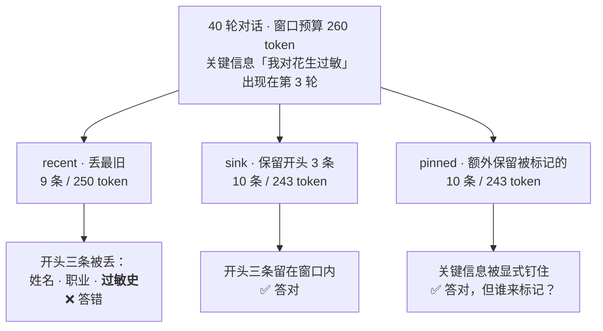
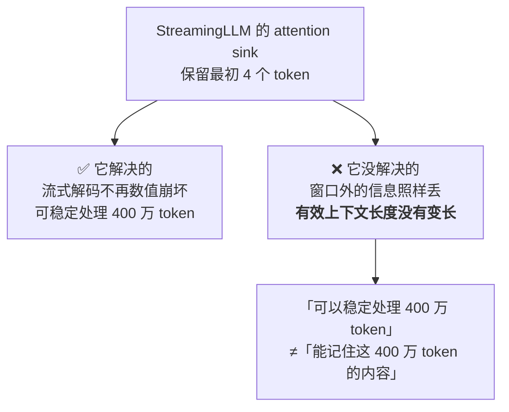
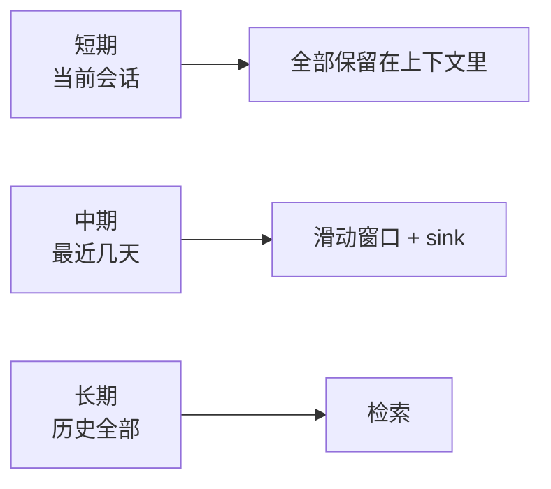

# 第二章 上下文与长上下文记忆

> 💡 **一句话**：上下文总会满。问题不是会不会丢，而是**丢什么**。
>
> ⏱ 约 30 分钟　|　难度 ●○○　|　前置：第 1 章　|　💻 `python -m minimem.learn ch02`
>
> **学完你能**
> 1. 说清楚「上下文满了」有三种不同的含义，各自该怎么应对。
> 2. 判断三种淘汰策略分别丢掉什么，以及为什么默认策略最糟。
> 3. 说明 StreamingLLM 的 attention sink 解决了什么、**没有**解决什么。
> 4. 算出压缩的收益与它系统性丢失的东西。
>
> **主线产出**：`minimem/window.py` 里的 `WindowMemory`。
>
> **本章实验**：两个，各几秒，全部离线，无需 API Key。

---

## 2.1 「上下文满了」其实有三种意思

第 1 章说过，记忆最终都要经由上下文起作用。那么上下文的边界在哪？

这里有个容易混淆的地方：「上下文不够用」在实践中至少是三个不同的问题，解法完全不同。

| 现象 | 真正的原因 | 该做什么 | 本章/本书位置 |
| :--- | :--- | :--- | :--- |
| 报错：超出最大 token 数 | 硬性上限 | 裁剪或压缩 | 2.2、2.5 节 |
| 不报错，但模型开始忘事 | **被静默截断了** | 检查截断策略 | 2.2 节 |
| 塞得下，但模型答得不好 | 长上下文的质量衰减 | 减少噪声，而不是加长窗口 | 第 3 章 |

第二种最危险，因为它没有任何报错。多数推理服务在输入超长时会**静默截断**，而且通常从最前面开始丢。系统日志一切正常，模型也不会抱怨，它只是给出了一个看起来合理、但缺少关键前提的回答。

第三种最容易被误诊。看到模型答不好，直觉是「上下文还不够长」，于是塞更多进去——结果更差。📄 Liu et al. 的 *Lost in the Middle*（arXiv:2307.03172, TACL 2024）测量了这个现象：关键信息位于长输入**中部**时，模型的检索准确率明显低于它位于开头或结尾时，形成一条 U 形曲线。

本章处理前两种。第三种是第 3 章的主题。

---

## 2.2 丢什么

> 🤔 **先猜一猜**
>
> 一段 40 轮的对话，用户在**第 3 轮**说了「我对花生过敏」，之后全是日常闲聊。
> 窗口预算只装得下十几轮。用最常见的「丢最旧的」策略，最后问「我对什么过敏」，能答对吗？
>
> A. 能 —— 过敏这么重要的信息，系统会保留
> B. 不能 —— 它恰好是最先被丢掉的三条之一
>
> <details>
> <summary>想好了再展开</summary>
>
> **B。** 而且这不是巧合。
>
> **用户倾向于在对话开头交代背景**——姓名、职业、禁忌、目标——然后在几十轮之后期待你还记得。而「丢最旧的」策略丢掉的恰好是这些。
>
> 选 A 的人默认系统会「识别重要性」。但滑动窗口不看重要性，只看年龄。而在对话里，**重要性和年龄往往是负相关的**。
>
> </details>

### 2.2.1 三种策略

```bash
python docs/chapter2/code/01_what_gets_dropped.py
```

`WindowMemory` 实现了三种淘汰策略：

| 策略 | 做法 | 一句话评价 |
| :--- | :--- | :--- |
| `"recent"` | 只保留最近的，丢最旧 | 几乎所有对话应用的默认行为，也是最糟的 |
| `"sink"` | 始终保留开头若干条 + 最近的 | 成本几乎不变，效果显著改善 |
| `"pinned"` | 在 sink 基础上额外保留被标记的记忆 | 有效，但把问题推给了「谁来标记」 |

实测（窗口预算 260 token，对话 40 轮）：

```
  策略                            窗口内条数    上下文 token    能否答对
  --------------------------------------------------------------------
  全历史（无窗口，作基线）                 40         1037        ✅
  recent（丢最旧，默认行为）               9          250        ❌
  sink（保留开头 3 条）                 10          243        ✅
  pinned（钉住关键信息）                10          243        ✅
```

被 `recent` 丢掉的前三条是：

```
    · 你好，我叫小明。
    · 我在星辰银行工作，是一名信贷风控工程师。
    · 我对花生过敏，以后帮我点餐一定要注意。
```

**注意 token 那一列**：三种策略的成本几乎相同（都受同一个预算约束），但效果差别是「答对」和「答错」。



成本几乎一样，差别只在**丢弃顺序**。这是本章投入产出比最高的一处改动。

> **这是本章最划算的一个优化**：不增加任何成本，只改变丢弃顺序。
> 如果你的系统现在用的是朴素滑动窗口，改成保留开头几条，可能是投入产出比最高的一次改动。

### 2.2.2 实现要点

`visible()` 是 `WindowMemory` 的核心，三种策略的差别全在这个方法里。有一个顺序上的细节值得说：

```python
# 第一步：先把必须保留的占位（sink 与 pinned）
for i in sorted(set(must)):
    if used + costs[i] <= budget:
        keep.add(i)
        used += costs[i]

# 第二步：从最新往回填，直到预算耗尽
for i in range(len(items) - 1, -1, -1):
    ...
```

**必须先给 sink 占位，再填最近的。** 如果顺序反了，预算可能在轮到 sink 之前就用光了——那样 `"sink"` 策略会退化成 `"recent"`，而且退化得很安静：代码看起来是对的，行为却不是。

另一个设计决策：

```python
drop_from_store: bool = False
```

被挤出窗口的记忆**默认不真的删除**，只是不再可见。这个区分很重要——第 10 章的删除权要求的是真删除，而「移出窗口」不是删除。把两者混为一谈，会在合规上出问题。

### 2.2.3 sink 与 pinned 的局限

`sink` 救不了「中途才出现的关键信息」。如果用户在第 20 轮说「我换工作了」，保留开头三条一样救不了它。

`pinned` 能救，但它把问题推给了另一个问题：**谁来判断哪条值得钉？**

- 规则（关键词表）：覆盖不全。「过敏」能匹配，「我吃不了辣」不能。
- LLM 判断：每条消息一次额外调用。第 6 章会算这笔账。

> ✅ **检查点 2.2**
>
> `sink` 策略能救回哪类信息？又救不了哪类？
>
> <details>
> <summary>参考答案</summary>
>
> 能救「开场交代的背景」——姓名、职业、长期禁忌、目标。
>
> 救不了「中途才出现的关键信息」，比如第 20 轮才说的「我换工作了」。后者需要 `pinned` 或检索，而「谁来判断哪条值得钉」本身就是一次额外的判断成本。
>
> </details>

---

## 2.3 attention sink：一个被广泛误传的机制

`"sink"` 这个名字借自 StreamingLLM（📄 Xiao et al., arXiv:2309.17453, ICLR 2024）。

### 它发现了什么

Transformer 会把**大量注意力分配给序列最开始的几个 token**，即使这些 token 在语义上无关紧要（比如一个句首的换行符）。论文把这个现象称为 **attention sink**——注意力的「水槽」。

后果是：在流式解码中，如果按滑动窗口驱逐 KV cache，一旦这几个初始 token 被丢掉，模型输出质量会**急剧崩坏**。而只要保留最初 4 个 token 作为 sink，流式解码就能稳定进行下去。

📄 论文原文报告：相比滑动窗口重算的基线，StreamingLLM 达到「up to 22.2× speedup」，并且用 4 个初始 sink token 就能「reliably model 4 million tokens」。

### 它**没有**解决什么

这里是本节的重点，也是这个领域最常见的以讹传讹：

> **StreamingLLM 不扩展模型的有效上下文长度。**

「reliably model 4 million tokens」的意思是「可以稳定地流式处理 400 万个 token 而不崩」，**不是**「模型能记住这 400 万个 token 里的内容」。窗口外的信息该丢还是丢了——它只是让丢弃的过程不再引发数值灾难。

所以，把它说成「让模型能记更多」是错的。



### 那本章为什么借用这个名字

因为**形状相同**：都是「保留开头几个」。但解决的问题不同：

| | StreamingLLM | 本章的 `"sink"` 策略 |
| :--- | :--- | :--- |
| 层次 | 推理引擎的 KV cache | 应用层的消息列表 |
| 保留什么 | 最初的几个 **token**（语义无关） | 最初的几条 **消息**（语义关键） |
| 解决什么 | 流式解码的数值稳定性 | 关键背景信息的丢失 |
| 谁实现 | 推理框架 | 你的应用代码 |

**混为一谈会导致一个具体的错误决策**：以为「我用的推理框架支持 StreamingLLM，所以不用管上下文管理了」。

---

## 2.4 KV cache 压缩：不在你的控制范围内的那一层

顺着 attention sink 往下，还有一类工作是在**推理层**压缩 KV cache：

- **H2O**（Heavy-Hitter Oracle）：观察到少数 token 贡献了大部分注意力，只保留这些「重仓股」。
- **SnapKV**：在生成前根据 prompt 的注意力模式压缩 KV cache。
- **Infini-attention / Memorizing Transformer / Landmark Attention / RMT**：在架构层引入某种形式的长期状态。

这些工作与本书的关系需要说清楚：

**它们通常不在你的控制范围内。** 如果你调用的是 API，KV cache 怎么管由服务方决定；如果你自己部署，那是推理框架的配置项，而不是应用代码。

**但它们会影响你的观测。** 一个具体的例子：如果服务方启用了某种 KV cache 驱逐策略，那么「同样的 prompt 得到不同的输出」就可能不是你的 bug。这类问题在排查时极难定位，值得知道它存在。

本书主线不涉及这一层。第 9 章会讨论另一种「不在应用层」的记忆——写进权重。

---

## 2.5 压缩：用信息损失换 token

> 🤔 **先猜一猜**
>
> 在**相同的 token 预算**下，两种做法：
> （1）保留最近的原始对话；（2）把 20 轮对话压成结构化事实。
>
> 对 7 个关键信息点，各能覆盖几个？
>
> A. 截断 1/7，摘要 7/7
> B. 截断 4/7，摘要 6/7
> C. 两者差不多 —— 压缩会丢信息，抵消了优势
>
> <details>
> <summary>想好了再展开</summary>
>
> **A。** 截断只覆盖 1/7，摘要覆盖 7/7。
>
> 截断保留的是「最近说的」，摘要保留的是「重要的」——而这两者在对话里往往不重合。
>
> 选 C 的直觉是「压缩必然丢信息」。压缩确实丢信息，但它丢的是**寒暄和冗余**；截断丢的是**事实本身**。关键在于看丢掉的那部分值不值钱。
>
> </details>

```bash
python docs/chapter2/code/02_compression.py
```

```
  方案                       token       压缩率      关键信息覆盖
  --------------------------------------------------------
  原文全带                       246      100%           7/7
  截断（保留最近）                    60       24%           1/7
  规则式摘要                       66       27%           7/7
```

实验用的是**规则式**摘要（正则抽取「属性 = 值」），不是 LLM。这么设计有两个理由：保持离线可跑；以及把「压缩」这个机制和「LLM 有多聪明」分开——你会看到，即使是规则式压缩，压缩率也已经很可观。

### 2.5.1 摘要丢掉了什么

这是本节比数字更重要的部分。

**第一，行动指引丢失。**

```
「我对花生过敏，点餐要注意。」  →  「过敏原：花生」
```

丢掉的是「点餐要注意」这个**行动指引**。用户说这句话时，真正想表达的是一个持续生效的约束，而不只是一个属性值。规则式摘要抽不出它，LLM 摘要也经常抽不出——因为它不在「属性 = 值」这个模式里。

**第二，不确定性被抹掉。** 这是最隐蔽的一种失真：

```
「这个项目做了快一年了。」  →  「项目周期：一年」
```

原文是模糊表述，压缩后变成了确定断言。**压缩会系统性地把「大概、可能、我记得」变成事实。** 而下游的模型无从知道这个「一年」原本带着「快」字。

**第三，多次压缩会持续退化。** 第 7 章的分层调度里，冷层数据会被反复摘要——摘要的摘要的摘要。信息在这个过程中持续衰减，而每一次衰减都看起来是合理的。第 7 章会专门测这条曲线。

### 2.5.2 一条实践原则

> **压缩要保留原文指针。**

摘要里存一条「来源：第 5 轮消息」，需要细节时能回查。这个设计在两个地方会兑现：第 5 章的 provenance（可审计性），第 7 章的分层（冷层回捞）。

代价是存储和写入复杂度都上升。但相比「压缩后原文就找不回来了」，这笔投入几乎总是值得的。

> ✅ **检查点 2.5**
>
> 摘要式记忆最隐蔽的失真是什么？
>
> <details>
> <summary>参考答案</summary>
>
> **不确定性被抹掉。** 「这个项目做了快一年了」压成「项目周期：一年」，模糊表述变成了确定断言。压缩会系统性地把「大概、可能、我记得」变成事实。
>
> 其次是**行动指引丢失**：「我对花生过敏，点餐要注意」→「过敏原：花生」，后半句的约束没了。
>
> </details>

---

## 2.6 Titans：让模型在推理时学习

📄 Titans（Behrouz et al., Google, arXiv:2501.00663, NeurIPS 2025）代表另一个方向：**给模型加一个在测试时学习的神经长期记忆模块**。

核心思路有两点值得记住：

**1. 用「意外程度」决定记什么。** 它把关联记忆损失的梯度作为「surprise」信号——一个输入越出乎意料，越值得写进记忆。这个思路很有启发性，因为它给「重要性」提供了一个不需要额外 LLM 调用的定义。

**2. 用衰减机制决定忘什么。** 与本章的「按年龄丢弃」相比，这是一种更接近「按价值丢弃」的做法。

论文给出三个变体（MAC / MAG / MAL），报告 MAC 在长上下文任务（NIAH、BABILong）上更优。

⚠️ **关于它的定位**：Titans 的部分 SOTA 声称在社区中有呼吁更严格对比的声音。而更重要的是——**它是一个架构层的方案**，需要训练，不是你能加在现有 API 调用上的东西。本书把它列在这里是因为它的**思路**（surprise 驱动的写入决策）值得借鉴，第 8 章讨论「什么值得记」时会回到这个想法。

---

## 2.7 长上下文 vs 检索：不是二选一

这个领域流传两句互相矛盾的话：「长上下文杀死了 RAG」和「RAG 让长上下文变得没意义」。**两句都错。**

它们在四个维度上的取舍完全不同：

| 维度 | 长上下文（全塞进去） | 检索（只带相关的） |
| :--- | :--- | :--- |
| **成本** | 随历史长度增长（第 1 章：O(N²) 累计） | 近似常数 |
| **延迟** | 随输入长度增长 | 检索开销 + 固定的短 prompt |
| **信息完整性** | 无损（窗口内） | 有检索误差 |
| **更新与删除** | 不适用（每次重建） | 可精确定位与删除 |
| **可审计** | 难（一整团文本） | 易（每条记忆可溯源） |

实践中通常是**组合**：



这个三层结构就是第 7 章 `LayeredMemory` 的雏形。

**怎么判断你该往哪边走**：算一下你的对话平均轮数。第 1 章给过经验分界——**不到 30 轮，全历史注入几乎肯定是更好的选择**。

---

## 2.8 代价与选型

| 方案 | 单轮 token | 信息保留 | 额外依赖 | 什么时候选 |
| :--- | :--- | :--- | :--- | :--- |
| 全历史 | 随轮数线性增长 | 无损 | 无 | < 30 轮 |
| `recent` 窗口 | 常数 | **丢开头** | 无 | 不推荐（除非只关心最近状态） |
| `sink` 窗口 | 常数 | 保住开场背景 | 无 | 窗口方案的默认选择 |
| `pinned` 窗口 | 常数 | 保住被标记的 | 需要标记逻辑 | 有明确的关键信息类型时 |
| 规则式压缩 | 常数，更小 | 丢细节与不确定性 | 无 | 事实型信息为主 |
| LLM 压缩 | 常数，更小 | 同上，质量更好 | LLM 调用 | 读写比高（第 6 章算账） |
| 检索 | 常数 | 有检索误差 | 嵌入模型 | 需要跨会话（第 3 章） |

**给实践者的建议**：

1. **先把 `recent` 换成 `sink`**。零成本，收益明确。
2. **压缩之前先问读写比**。写一次读一百次，压缩划算；写一次读一次，纯亏。
3. **压缩一定保留原文指针**。

---

## 2.9 常见误区

**误区一：「窗口够大就不用管了」**

三种「满」里，静默截断最危险，而它在窗口很大时依然会发生——只是发生得更晚、更难察觉。

**误区二：「StreamingLLM 能让模型记更多」**

2.3 节：它解决 KV cache 的数值稳定性，不扩展有效上下文。窗口外的信息该丢还是丢。

**误区三：「丢最旧的很合理，毕竟旧信息不重要」**

2.2 节实测反例：被丢掉的前三条正是姓名、职业、过敏史。重要性和年龄在对话里往往负相关。

**误区四：「摘要就是无损压缩」**

2.5 节：行动指引和不确定性会被系统性地抹掉，而且多次摘要会持续退化。

**误区五：「长上下文和 RAG 二选一」**

2.7 节：四个维度的取舍完全不同，实践中通常组合使用。

---

## 2.10 小结

- 「上下文满了」有三种含义：硬性上限、静默截断、质量衰减。**第二种最危险**（无报错），第三种最容易误诊（加长窗口反而更差）。
- **「丢最旧的」丢掉的恰好是最该留的**，因为用户在开头交代背景。改成保留开头几条，成本几乎不变——本章投入产出比最高的改动。
- StreamingLLM 的 attention sink 解决 KV cache 的数值稳定性，**不扩展有效上下文**。本章借的只是「保留开头」这个形状。
- 相同预算下，摘要的信息密度远高于截断（实测 7/7 对 1/7），但它会系统性丢失**行动指引**与**不确定性**，且多次压缩持续退化。
- **压缩要保留原文指针**，否则细节永久丢失。
- 长上下文与检索在成本、延迟、完整性、可审计性上各有取舍，实践中组合使用——这个组合就是第 7 章分层记忆的雏形。

---

## 🔧 动手挑战

**🟢 五分钟**

把实验一的 `BUDGET` 从 260 调到 500，看三种策略的差距怎么变。

- 起点：`docs/chapter2/code/01_what_gets_dropped.py` 顶部的 `BUDGET`
- 做对了会看到：预算够大时三种策略趋同——**窗口策略只在预算紧张时才重要**

**🟡 半小时到一小时**

给 `WindowMemory` 加一种 `"summary"` 策略：被挤出窗口的内容不是丢弃，而是压成一条摘要留在窗口里。用实验一验证它能否答对过敏题。

- 起点：`minimem/window.py` 的 `visible()`，可复用实验二的 `rule_summarize`
- 做对了会看到：窗口内多一条「摘要」，且过敏题答对
- 验证：`python -m pytest tests/test_window.py -q`

**🔴 半天以上**

实现「摘要退化」的测量：把一段对话反复摘要 5 次（摘要的摘要的摘要……），每轮测一次关键信息覆盖率，画出退化曲线。

- 起点：`docs/chapter2/code/02_compression.py` 的 `rule_summarize`
- 做对了会看到：一条随迭代次数下降的曲线——这正是第 7 章分层调度要面对的问题

---

## 🧠 复习卡片

`python -m minimem.learn cards ch02` 可以在终端里过一遍，`python -m minimem.learn review` 会按间隔重复安排。

<details>
<summary>为什么「丢最旧的」是最糟糕的默认淘汰策略？</summary>

因为用户倾向于在对话开头交代背景（姓名、职业、禁忌、目标），而这些恰好是最先被丢掉的。重要性和年龄在对话里往往负相关。改成保留开头几条（sink），成本几乎不变，效果差别巨大。
</details>

<details>
<summary>相同 token 预算下，截断和摘要哪个信息密度高？为什么？</summary>

摘要高得多（实测 7/7 对 1/7）。截断保留「最近说的」，摘要保留「重要的」，而两者在对话里往往不重合。但摘要的代价是每次要一次 LLM 调用，且会丢失行动指引与不确定性。
</details>

<details>
<summary>StreamingLLM 扩展了模型的有效上下文长度吗？</summary>

没有。它解决的是 KV cache 的数值稳定性——保留最初几个 token（attention sink）让流式解码不崩。把它说成「让模型能记更多」是误传。
</details>

<details>
<summary>压缩式记忆最隐蔽的失真是什么？</summary>

不确定性被抹掉。「这个项目做了快一年了」→「项目周期：一年」，模糊表述变成确定断言。其次是行动指引丢失：「我对花生过敏，点餐要注意」→「过敏原：花生」，后半句的约束没了。
</details>

---

## 🚪 下一章

窗口方案用「彻底遗忘」换来了恒定成本。但被丢掉的东西**再也找不回来**了。

有没有办法既不全带，又不真丢？

→ **第 3 章：不丢弃，但也不全带——用检索决定每一轮带哪几条。**

---

## 参考文献

1. 📄 Xiao, G., Tian, Y., Chen, B., Han, S., Lewis, M. *Efficient Streaming Language Models with Attention Sinks*. arXiv:2309.17453, ICLR 2024. （attention sink 的出处；注意它不扩展有效上下文）
2. 📄 Behrouz, A., et al. *Titans: Learning to Memorize at Test Time*. arXiv:2501.00663, NeurIPS 2025. （⚠️ 部分 SOTA 声称有待更严格的第三方对比）
3. 📄 Liu, N. F., et al. *Lost in the Middle: How Language Models Use Long Contexts*. arXiv:2307.03172, TACL 2024.
4. 📄 Zhang, Z., et al. *H2O: Heavy-Hitter Oracle for Efficient Generative Inference of Large Language Models*. NeurIPS 2023. （KV cache 驱逐）
5. 📄 Li, Y., et al. *SnapKV: LLM Knows What You are Looking for Before Generation*. NeurIPS 2024.

> **本章数字的可信度说明**：2.2、2.5 节的表格来自本章脚本在单机 CPU 上的实测，可复现。
> 2.3 节引用的 StreamingLLM 数字（22.2× 加速、4M token）为 📄 论文原文报告。
> 2.6 节对 Titans 的定位说明标 ⚠️，因为其部分声称尚缺充分的第三方对比。
