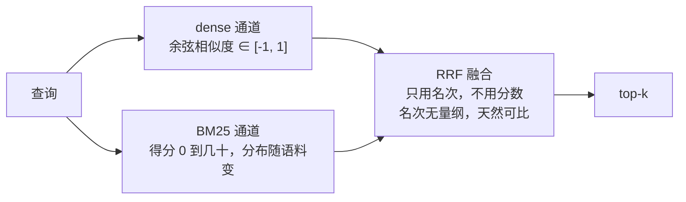
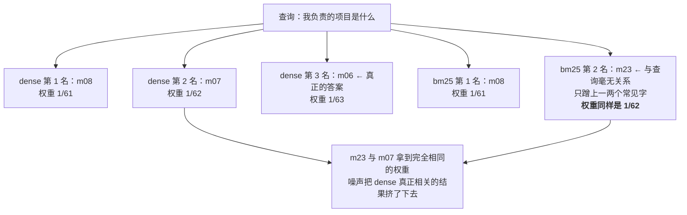

# 第三章 检索增强记忆基础

> **本章目标**
>
> 1. 用句向量推倒第 1 章的「语义鸿沟」墙，并且**证明推倒它的是语义，不是架构**。
> 2. 说清楚稠密向量的结构性盲区，以及为什么 2026 年了还要用 BM25。
> 3. 讲透 RRF 融合，包括它一个容易踩、而且很难发现的坑。
> 4. 回答「一条记忆应该多大」，并给出判断依据。
> 5. 把规模与延迟测出来，说明什么时候才真的需要 ANN 索引。
>
> **本章实验**：前三个各几秒，第四个约一分钟。需要一个句向量模型（约 95MB，
> 从 ModelScope 下载）；完全离线时可用 `AGENT_MEM_EMBED_MODEL=fake` 跑通流程。
>
> **主线产出**：`minimem/vector.py` 里的 `VectorMemory`。

---

## 3.1 先把问题定准

第 1 章的 `BufferMemory` 撞了三堵墙。本章只处理第一堵——**语义鸿沟**：

```
Q: 他的职业是什么？
A: 我们家的猫叫毛毛，今年三岁。   ❌
```

查询和目标记忆「我从事信贷风险评估工作」一个字都不共享，字面匹配必然失败。

解决思路上一节课就学过了：把文本映射成向量，让「意思相近」变成「距离相近」。这是 RAG 的标准操作，本章不会花篇幅重讲 embedding 的原理。

**本章真正想讲的是四件容易被跳过的事**：

1. 怎么**证明**改善来自语义，而不是来自「换了个架构」这种心理作用。
2. 稠密向量在哪里会稳定地失败——不是偶尔失败，是结构性地失败。
3. 「一条记忆多大」这个问题，在记忆场景和 RAG 场景为什么不一样。
4. 检索延迟的瓶颈，经常不在你以为的地方。

---

## 3.2 表征：把意思变成向量

### 3.2.1 一个对照实验的设计

先跑：

```bash
python docs/chapter3/code/01_semantic_vs_literal.py
```

三个方案，跑同一份 MiniBench（30 条记忆、24 个查询）：

| 方案 | 表征 | 检索 |
| :--- | :--- | :--- |
| `BufferMemory` | 字符集合 | Jaccard 重叠 |
| `VectorMemory` + **FakeEmbedder** | 哈希 n-gram 向量 | 余弦相似度 |
| `VectorMemory` + 真实句向量 | bge-small-zh（512 维） | 余弦相似度 |

中间那一组是这个实验的关键。`FakeEmbedder` 是一个**假件**：它把文本切成字符 bigram，用 MD5 哈希投影到 256 维上累加。它输出的是形状正确的向量，走的是完全相同的检索管线，但它**不懂任何语义**——它保留的仍然只是字面重叠。

为什么要加这一组？因为如果只比 `BufferMemory` 和真实向量，你无法区分两个因素：

- 改善来自「向量检索」这个架构（也许 top-k、余弦相似度、候选池设计本身就更好）？
- 还是来自「向量真的编码了语义」？

假件把这两个因素分开了。这是本书会反复用到的验证手法：**怀疑某个改进是不是真的时，把关键组件换成一个形状相同但没有能力的假件，看指标掉不掉。**

### 3.2.2 结果

```
  方案                            总召回率@5
  --------------------------------------
  BufferMemory（字面）              79.2%
  Vector + fake（哈希）             71.5%
  Vector + 真实向量                 88.2%
```

结论很干脆：**假件不但没赢，还输给了第 1 章的字面基线**。所以「换成向量检索」这个架构动作本身不带来任何东西，全部改善来自向量本身。

分能力看更有意思：

```
  能力            BufferMemory   Vector+fake   Vector+真实
  ----------------------------------------------------
  直接检索               100%          100%          100%
  同义改写                70%           60%           70%
  专有名词               100%          100%          100%
  多跳                  75%           50%           50%
  时序                 100%           67%          100%
  知识更新                25%           42%          100%
  归纳                  25%           17%           83%
  拒答                 100%          100%          100%
```

有三处值得停下来看：

**第一，「同义改写」上真实向量并没有赢。** 这与直觉相反——那不正是它该赢的地方吗？

原因是 `k=5` 太宽松了。30 条记忆里取 5 条，字面匹配靠一两个共享字也能把目标挤进前五。把 k 降到 1 再看：

```
  方案                             k=1       k=3       k=5      k=10
  ----------------------------------------------------------------
  BufferMemory（字面）            70.8%     77.1%     79.2%     86.1%
  Vector + fake（哈希）           43.8%     67.4%     71.5%     84.0%
  Vector + 真实向量               70.1%     84.7%     88.2%     96.5%
```

k=1 时两者几乎打平，k=10 时差距拉到 10 个百分点。

> 这张表本身就是一个重要结论：**任何「A 比 B 好 X%」的说法，不指明 k 就没有意义。**
> 而这个前提在厂商基准报告里经常缺席。第 10 章会展开。

**第二，真实向量赢在「知识更新」和「归纳」上**（25%→100%，25%→83%）。这两类题的共同点是——答案散落在**多条**记忆里，需要把它们都捞回来。语义相似度天然擅长这件事：它能把「我在星辰银行工作」「我下周就要离职了」「下个月入职长风科技」这三条都识别为与「我在哪家公司上班」相关，而字面匹配只能命中含「工作」二字的那一条。

**第三，「多跳」上真实向量反而更差**（75%→50%）。多跳题要求两条 gold 都被召回，而语义相似度会把「意思相近但不是答案」的记忆排到前面，挤掉第二条 gold。这个问题第 4 章用图结构解决。

### 3.2.3 关于这些数字的诚实说明

MiniBench 只有 30 条记忆、24 个查询。单题权重高达 4%，**任何一两个百分点的差异都是噪声**。

它能支撑的结论只有「量级」和「方向」：语义向量在需要跨表述聚合的任务上有实质提升，在需要精确定位的任务上没有，这两个方向是稳定的。它**不能**支撑「方案 A 比方案 B 强 8.7%」这样的说法。

本书全程遵守这个纪律。你在第 10 章会看到，不遵守它会导致什么。

---

## 3.3 稠密向量的结构性盲区

### 3.3.1 相似不等于相同

语义相似度的定义决定了一件事：**「意思相近但不是同一个东西」也会被判为相近**。

最典型的受害者是标识符。跑实验二：

```bash
python docs/chapter3/code/02_hybrid_search.py
```

```
  向量空间里，这两个项目号有多像？
    sim(XR-2049 那条, XR-2050 那条) = 0.651
    sim(XR-2049 那条, 猫那条)        = 0.305

    查询「XR-2049 是什么项目？」对两条项目记忆的相似度：
      XR-2049 那条 = 0.681
      XR-2050 那条 = 0.580
      差距只有 0.101——排序稍有扰动就会颠倒。
```

这不是模型的缺陷。从语义上说，「XR-2049 反欺诈模型」和「XR-2050 小微企业评分」**确实**极其相似：都是项目、都是风控、都是 XR 系列，只差一个数字。模型忠实地反映了这一点。

问题在于，用户问「XR-2049」时，他要的恰恰是那个数字。

### 3.3.2 把它放大：压力测试

MiniBench 里只有两个相似编号，bge 还勉强分得开（专有名词类召回率 100%）。真实系统里同族标识符成千上万——工单号、SKU、合同编号、订单号。

实验二构造了 12 个只差数字的项目编号，然后逐个精确查询：

```
  模式      top-1 命中率     说明
  --------------------------------------------------------
  dense     7/12            语义上这 12 条几乎一样
  bm25      12/12           编号是精确 token，直接命中
  hybrid    12/12           BM25 把正确答案顶上来
```

稠密向量掉到 7/12，BM25 全中。

> **方法论备注**：MiniBench 上测不出 dense 和 bm25 的差别，不等于这个差别不存在。
> 这是小基准的典型问题——**基准测不到某个机制的价值，不代表那个机制没价值**。
> 很多论文和厂商报告里「我们的方法在 X 上提升了 Y%」，如果 X 本身测不到关键差异，
> 那个 Y 就不能说明什么。所以本书在小基准之外，还给关键机制配了针对性的压力测试。

除了标识符，稠密向量还有两类稳定的弱项：

- **罕见词与新词**：训练语料里没怎么出现的词，向量表示接近噪声。产品刚上线的功能名、内部黑话、生僻人名都属于这类。
- **否定与限定**：「不归我管」和「归我管」的向量距离，往往比它们与无关句子的距离小得多。这一点在记忆场景尤其危险，因为用户的偏好经常是否定式的（「别在早上安排会议」）。

---

## 3.4 混合检索与 RRF

### 3.4.1 BM25：一个仍然打不过的老基线

BM25 的评分公式：

$$
\text{score}(q, d) = \sum_{t \in q} \text{IDF}(t) \cdot \frac{f(t, d) \cdot (k_1 + 1)}{f(t, d) + k_1 \cdot \left(1 - b + b \cdot \frac{|d|}{\text{avgdl}}\right)}
$$

两个参数的直观含义：

- $k_1$ 控制**词频饱和**。一个词出现 10 次，不该比出现 5 次「相关两倍」。$k_1$ 越小，饱和越快。
- $b$ 控制**长度惩罚**。$b=1$ 完全按长度归一化，$b=0$ 不惩罚长文档。

默认 $(1.5, 0.75)$ 是检索领域的经验值。完整实现见 [`minimem/utils/bm25.py`](https://github.com/emmmdty/agent-mem/blob/main/minimem/utils/bm25.py)，约 60 行。

**中文分词**是个需要交代的选择。本书用「英文按词切 + 中文字符 bigram」：

```python
def tokenize(text: str) -> list[str]:
    tokens = _WORD_RE.findall(text.lower())  # XR-2049 保持完整
    cjk = _CJK_RE.findall(text)
    tokens.extend(cjk)  # 单字
    cjk_str = "".join(cjk)
    tokens.extend(cjk_str[i : i + 2] for i in range(len(cjk_str) - 1))  # bigram
    return tokens
```

为什么不用 jieba？两个理由：零依赖，以及**bigram 对未登录词更鲁棒**——新出现的产品名、人名不会被切错。代价是词表更大、噪声更多。真实项目里建议实测后再定。

### 3.4.2 RRF：只看名次，不看分数

有了两路检索结果，怎么合并？

直觉方案是加权求和。这个方案有个绕不过去的问题：**量纲不同**。余弦相似度在 $[-1, 1]$，BM25 得分可以是 0 到几十，而且分布随语料变化。要相加就得先归一化，而任何归一化方案（min-max、z-score、softmax）都需要估计分布，估计不好就引入新的偏差。

RRF（Reciprocal Rank Fusion）绕开了这个问题——它只用名次：

$$
\text{RRF}(d) = \sum_{r \in \text{rankers}} \frac{w_r}{k + \text{rank}_r(d)}
$$

名次是无量纲的，天然可比。常数 $k=60$ 来自原始论文（Cormack et al., SIGIR 2009），作用是压低头部的绝对优势，让第 1 名和第 2 名的差距不至于碾压其他通道的贡献。

这是 RRF 的全部聪明之处，也是它的全部脆弱之处。



### 3.4.3 一个真实的坑：通道质量不对等

先看实验二在 MiniBench 上的结果：

```
  模式               召回率@5       MRR        检索延迟(ms)
  ------------------------------------------------
  dense           88.2%     0.896            2.15
  bm25            78.5%     0.868            0.34
  hybrid          86.8%     0.938            2.40
```

hybrid 的召回率**没有超过** dense。MRR 倒是最高。

而在最初的实现里，情况更糟——hybrid 只有 81.9%，分能力表上「知识更新」从 dense 的 100% 掉到 42%。一个融合了两路的方案，居然比其中一路差得多。

原因藏在 RRF 的设计里。看这次融合的中间过程：

```
    dense 通道排名：
      1. [m08] 另一个项目 XR-2050 是做小微企业评分的，不归我管。 (0.709)
      2. [m07] XR-2049 上线后，人工复核量下降了大概四成。      (0.533)
      3. [m06] 我负责的项目代号是 XR-2049，是个反欺诈模型。     (0.508)
    bm25 通道排名：
      1. [m08] 另一个项目 XR-2050 ...                        (7.662)
      2. [m23] 报了个在线课程，讲双重差分和断点回归的。          (2.282)   ← 噪声
```

`m23` 与查询毫无关系，它之所以进了 BM25 的第 2 名，只是因为蹭上了一两个常见字。而 RRF **只看名次**——「BM25 的第 2 名」和「dense 的第 2 名」拿到完全相同的权重 $1/62$。于是一条噪声把 dense 通道真正相关的结果挤了下去。



**当一个通道在某个查询上「无话可说」时，它返回的噪声依然享有满额的名次权重。** 这是 RRF 的结构性弱点，而且它很隐蔽：总召回率只掉几个百分点，不做分能力分析根本看不出来。


左图那根差距说明了一切：**混合检索赢的是排序质量（MRR），不是召回**。如果你的场景只看 top-k 里有没有，混合不一定值得。

修法是给通道内的候选设一个**相对门槛**：

```python
floor = scores[top[0]] * self.bm25_floor_ratio
keep = [i for i in top if scores[i] > 0 and scores[i] >= floor]
```

消融结果：

```
  floor            召回率@5       MRR
  ----------------------------------
  0.0             81.9%     0.938
  0.1             81.9%     0.938
  0.3             85.4%     0.938
  0.5             86.8%     0.938    ← 默认
  0.7             88.2%     0.906
```

`bm25_floor_ratio` 不是可有可无的调优旋钮，它是在**修一个 bug**。默认值 0.5 是在 MiniBench 上扫出来的经验值，换语料需要重新扫。

### 3.4.4 那么该不该用混合检索

基于上面的数据，诚实的建议是：

- **如果你的记忆里有大量标识符**（工单、订单、型号、代码符号），混合检索是必需的，不是优化。
- **如果记忆几乎全是自然语言对话**，纯 dense 通常就够了，混合带来的收益可能小于它引入的复杂度和延迟。
- **无论哪种情况，都要给弱通道设门槛**，否则融合可能让结果变差。

代价方面：hybrid 要跑两路检索、维护两套索引。本机实测延迟约为纯 dense 的 1.1 倍、纯 BM25 的 7 倍（BM25 在小数据上极快）。内存多一份倒排表。

---

## 3.5 一条记忆应该多大

### 3.5.1 这和 RAG 的 chunking 不是同一个问题

RAG 教程里 chunking 讨论的是「一篇长文档切多长」，核心矛盾是「切太碎丢上下文 / 切太大混主题」。

记忆场景不一样：**对话本来就是一条条来的**。你的选择不是「怎么切」，而是「要不要合并、要不要抽取」：

| 粒度 | 做法 | 特点 |
| :--- | :--- | :--- |
| **消息级** | 每条用户消息存一条 | 最细、最忠实，噪声也最多 |
| **会话级** | 相邻若干条合并 | 上下文完整，但一条里混了多个主题 |
| **事实级** | 抽出「属性 = 值」 | 最省最准，但需要 LLM，会丢细节 |

### 3.5.2 实测

```bash
python docs/chapter3/code/03_granularity.py
```

```
  粒度                        条数       召回率       准确率       上下文 token
  ------------------------------------------------------------------
  消息级（30 条）                 30     81.9%     18.3%              85
  会话级 / 3 条一组               10     95.1%      7.8%             255
  会话级 / 5 条一组                6    100.0%      5.2%             418
  会话级 / 10 条一组               3    100.0%      4.3%             500
```

三个数字同向变化：**粒度越粗，召回率越高、准确率越低、上下文越贵**。

这三者是同一个动作的三个侧面。一条大记忆当然更容易「盖住」答案，但它同时把大量无关内容一起塞进了 prompt。

看最后一行：全库只剩 3 条记忆，`k=5` 直接把整个库都返回了，召回率当然是 100%。**这个 100% 什么也没证明**——它等价于「不检索，全塞进去」，正是第 1 章我们想避免的方案。

> **本章最需要记住的一条**：检索指标必须**成组**看。
> 只看召回率会得出「粒度越粗越好」的荒谬结论；只看准确率会得出「一条都别返回最好」。
> 第 10 章会给出完整的指标组合，以及每个指标单独看时会怎么骗你。

### 3.5.3 噪声有多少

同一个脚本还算了另一笔账：

```
  噪声分析（消息级，k=5）
    平均每次检索返回：84 token
    其中命中 gold 的：  17 token
    噪声占比：          80%
```

**八成的 token 是噪声。** 它们要花钱，还会稀释模型的注意力。

这就是事实级抽取真正的价值来源——它不只是压缩，更是**去噪**。把

> 「我下周就要从星辰银行离职了，交接已经开始。」

压成

> 「当前雇主：星辰银行（离职中）」

既短，又不带无关信息。

代价是每条消息一次 LLM 调用。是否划算取决于**读写比**：写一次读一百次，抽取绝对划算；写一次读一次，就是纯亏。第 6 章会把这笔账算完整，包括抽取本身出错时会发生什么。

### 3.5.4 实践建议

**消息级 + top-5 是记忆场景的合理默认值。** 需要调整的情形：

- 单条消息很短（聊天记录一句一条）→ 按「对话轮」或「话题段」合并。
- 单条消息很长（用户粘贴了一大段）→ 这时才需要真正的 chunking，做法与 RAG 相同。
- 读写比高、且预算允许 → 上事实级抽取（第 6 章）。

---

## 3.6 规模、延迟与索引

### 3.6.1 墙推倒了吗

第 1 章测出 `BufferMemory` 的检索延迟随条数线性增长。换成向量检索之后：

```bash
python docs/chapter3/code/04_scale_and_index.py
```

```
  条数             Buffer 检索(ms)     Vector 检索(ms)      加速    Vector 写入(s)
  --------------------------------------------------------------------------
  1,000                   4.48             0.169       27×            0.02
  5,000                  20.58             1.292       16×            0.11
  20,000                 93.36             4.990       19×            0.46
  50,000                276.82            10.153       27×            1.15
```

**两条曲线都是线性的。** 向量检索没有降低复杂度，它降的是常数：一次 numpy 矩阵乘法（BLAS、SIMD、连续内存）对上一个 Python for 循环，本机约一个数量级以上的差距。

注意最后一列：**写入变贵了**。每条记忆都要过一次嵌入模型（这里用的是零成本的假模型，真实模型在 CPU 上大约每条几毫秒），还要维护索引。第 1 章的 `BufferMemory` 写入几乎免费。

> 这是本书会反复出现的模式：**检索侧省下的，往往在写入侧花掉了。**
> 判断划不划算，要看你的读写比——这句话本章已经说了第二遍，后面还会再说。

### 3.6.2 两个真实的性能坑

这组数字最初跑出来只有 7-9× 加速。定位后发现两个问题，都保留在代码里作为教材：

**坑一：用 `argsort` 而不是 `argpartition`。**

```python
top = np.argsort(-sims)[:cand_k]  # O(N log N)：对全部 5 万个排序
```

我们只要前 20 个，却对全部 5 万个做了完整排序。改成：

```python
part = np.argpartition(-scores, k)[:k]  # O(N)：只划分出前 k 个
return part[np.argsort(-scores[part])]  # 再对这 k 个排序
```

**坑二：纯 dense 模式下也构建了 BM25 索引。**

原来的 `_rebuild` 无条件重建两个索引。BM25 的 `fit` 要对全部文档分词并统计词频，五万条量级是百毫秒级操作——而它藏在第一次检索的延迟里，不 profile 根本看不见。改成两个通道各自惰性构建后：

```python
def _ensure_dense(self, idx): ...  # 只在 dense/hybrid 模式下调用
def _ensure_bm25(self, idx): ...  # 只在 bm25/hybrid 模式下调用
```

两处修完，50000 条的检索延迟从 35ms 降到 10ms。

**检索的瓶颈经常不在你以为的地方**——所以才要测，而不是靠推理。

### 3.6.3 什么时候才需要 ANN

暴力检索仍是 $O(N)$。真正的次线性需要 ANN（近似最近邻）索引：HNSW（分层可导航小世界图）、IVF（倒排文件）、PQ（乘积量化）等。

**经验分界大约在百万条**。在这个量级上暴力检索单次要几十到几百毫秒，超出交互式应用的预算；ANN 能压到毫秒级。

代价是**召回不再是 100%**——它是**近似**最近邻，会漏。

对记忆系统来说这个取舍尤其要小心。漏掉一条文档，用户可能不察觉；漏掉「我对花生过敏」，后果是另一个量级。所以常见做法是分层：热层精确、冷层近似（第 7 章）。

**但在你考虑 ANN 之前**：单用户五万条记忆，相当于一个每天聊 100 轮的重度用户积累一年半。多数产品在触碰到 ANN 的必要性之前，会先撞上另外两堵墙——**记忆质量**（一堆从没整理过的原始消息）和**成本**（每次检索的上下文越来越贵）。先解决那两个。

向量库选型（Chroma / Qdrant / Milvus / pgvector / LanceDB）见附录 B，那张表带更新日期，因为这类信息半年就会过时。

---

## 3.7 还有哪些提升手段，以及它们的代价

本章的 `VectorMemory` 停在「混合检索 + RRF」。业界常用的下一步是重排和查询改写，这里给出机制和代价，读者按需自取。本书主线不默认启用它们，理由在每一条后面。

### 重排（rerank）

检索用**双塔**模型：查询和文档各自编码成向量，算距离。快，因为文档向量可以预先算好。

重排用**交叉编码器**（cross-encoder）：把查询和文档拼在一起送进模型，直接输出相关性分数。准得多，因为模型能看到两者的交互。

代价是它**无法预计算**：$k$ 个候选就要 $k$ 次前向。典型做法是检索 top-50，重排后取 top-5。

| | 检索（双塔） | 重排（交叉编码） |
| :--- | :--- | :--- |
| 文档向量 | 可预计算 | 不可 |
| 单次查询计算量 | 1 次编码 + 1 次矩阵乘 | k 次前向 |
| 本机量级 | 毫秒 | 几十到几百毫秒 |

**什么时候值得**：候选池里有大量「主题相关但答非所问」的内容时。反过来，如果你的记忆库很小（几百条）、或者 top-5 已经足够干净，重排纯属浪费。

模型可选 `BAAI/bge-reranker-base`（约 1.1GB，`python -m minimem.utils.fetch_model BAAI/bge-reranker-base` 可下载）。

### 查询改写与 HyDE

用户的提问经常不适合直接拿去检索：「那个怎么样了？」里没有任何可检索的实词。

- **查询改写**：用 LLM 把它补全成「XR-2049 项目的上线效果怎么样了？」再检索。
- **HyDE**（Hypothetical Document Embeddings，📄 Gao et al., arXiv:2212.10496）：先让 LLM **编造**一个假想答案，再用这个假想答案去检索。反直觉但有效——假想答案和真实答案在向量空间里更接近，而问句和陈述句本来就是两种分布。

代价都是**每次检索多一次 LLM 调用**：延迟从几毫秒变成几百毫秒到一秒，成本从零变成实打实的 token。

**在记忆场景，查询改写往往比 HyDE 更值得做**，因为对话里的指代消解（「那个」「他」「上次说的」）是刚需，而且改写还能顺便把多轮上下文压进查询里。

### Self-RAG 一类的自反思检索

📄 Asai et al. 的 Self-RAG（arXiv:2310.11511）让模型自己判断「要不要检索」「检索回来的有没有用」「答案有没有被支持」。

思路很正，代价是多次 LLM 调用和一个需要特殊训练的模型。**在教程范围内不建议实现**，但它提出的那个问题值得记住：**不是每个查询都需要检索**。「帮我把这段翻译成英文」不需要任何记忆，但多数系统会照样跑一遍检索、照样把 5 条无关记忆塞进 prompt。加一个「要不要检索」的判断（哪怕是简单规则），常常比优化检索本身收益更大。

---

## 3.8 代价与选型

| 方案 | 写入代价 | 检索代价 | 依赖 | 什么时候选 |
| :--- | :--- | :--- | :--- | :--- |
| `BufferMemory` | 0 | O(N) Python 循环 | 无 | < 1000 条，或作基线 |
| `VectorMemory` dense | 1 次编码/条 | O(N) 矩阵乘 | 嵌入模型 | 默认选择 |
| `VectorMemory` hybrid | 1 次编码 + 倒排 | 两路 + 融合 | 嵌入模型 | 记忆里有大量标识符 |
| + 重排 | 同上 | + k 次交叉编码 | 重排模型 | 候选噪声大、预算够 |
| + 查询改写 | 同上 | + 1 次 LLM 调用 | LLM API | 对话里指代多 |
| + ANN 索引 | + 建索引 | O(log N) 近似 | 向量库 | > 百万条 |

**决策顺序建议**：

1. 先用 dense，测一遍（第 10 章的 harness）。
2. 分能力看结果。专有名词类差 → 加 BM25；主题对但答不对 → 加重排；指代类差 → 加查询改写。
3. **不要一次全上**。每加一样都要能回答「它让哪一类查询变好了，代价是多少」。

---

## 3.9 常见误区

**误区一：「上了向量库就是有记忆了」**

向量库提供了八种操作里的两种（索引、检索）。更新、遗忘、巩固、反思一个都没有。第 1 章的墙二、墙三，本章一个都没解决——`VectorMemory` 依然会把「星辰银行」和「长风科技」两条矛盾记忆一起返回。

**误区二：「召回率越高越好」**

3.5 节的粒度实验给了反例：把全库合并成 3 条，召回率 100%，但那等于放弃检索。指标要成组看。

**误区三：「换个更大的 embedding 模型就能解决」**

3.3 节的盲区是**结构性**的，不是容量问题。更大的模型会把 XR-2049 和 XR-2050 编码得更精细，但它们在语义上确实相似这个事实不会改变。该用 BM25 的地方还是要用。

**误区四：「hybrid 一定比单路好」**

3.4.3 节的实测反例：不设门槛的 RRF 融合，在 MiniBench 上比纯 dense 差 6 个百分点。融合不是免费的午餐。

**误区五：「检索慢就上 ANN」**

先 profile。本章两个真实的性能坑（`argsort` 与无条件建 BM25 索引）加起来占了 70% 的延迟，跟索引结构毫无关系。

**误区六：「每个查询都要检索」**

「帮我翻译这段」不需要任何记忆。加一个「要不要检索」的判断，常常比优化检索本身收益更大。

---

## 3.10 小结

- 语义向量推倒了第 1 章的第一堵墙，而 `FakeEmbedder` 对照实验证明了**推倒它的是语义本身，不是「换成向量检索」这个架构动作**。
- 但它赢的地方和直觉不同：在需要跨表述聚合的任务（知识更新、归纳）上大幅领先，在需要精确定位的任务（专有名词）和多跳上不占优甚至更差。
- 稠密向量的盲区是结构性的：标识符、罕见词、否定式。BM25 在这些地方稳定更好，这是混合检索存在的理由。
- RRF 只看名次，因此在通道质量不对等时会被噪声劫持。**给弱通道设相对门槛是必需的，不是调优。**
- 记忆的粒度不是 chunking 问题，而是「合并还是抽取」。**消息级 + top-5 是合理默认值**；粗粒度的高召回率往往是假的。
- 向量检索没有降低复杂度，只降低了常数。**真正的性能瓶颈要靠 profile 找，不要靠推理猜。**
- 检索侧省下的，往往在写入侧花掉了。判断依据是读写比。

第 1 章的三堵墙，本章推倒了第一堵，第二堵挪后了一个数量级。第三堵——**知识演化**——原封不动：`VectorMemory` 依然不知道哪条事实已经过期。

下一章先处理另一个更基础的问题：当记忆之间**有关系**时，扁平的向量列表就不够用了。多跳查询上的失败（本章 50% 的召回率）就是这个问题的症状。

---

## 参考文献

**检索基础**

1. 📄 Robertson, S., Zaragoza, H. *The Probabilistic Relevance Framework: BM25 and Beyond*. Foundations and Trends in Information Retrieval, 2009. （BM25 的权威综述）
2. 📄 Cormack, G. V., Clarke, C. L. A., Buettcher, S. *Reciprocal Rank Fusion Outperforms Condorcet and Individual Rank Learning Methods*. SIGIR 2009. （RRF 的原始论文，$k=60$ 的出处）

**查询侧技术**

3. 📄 Gao, L., Ma, X., Lin, J., Callan, J. *Precise Zero-Shot Dense Retrieval without Relevance Labels*. arXiv:2212.10496. （HyDE）
4. 📄 Asai, A., Wu, Z., Wang, Y., Sil, A., Hajishirzi, H. *Self-RAG: Learning to Retrieve, Generate, and Critique through Self-Reflection*. arXiv:2310.11511, ICLR 2024.

**中文向量模型**

5. 🕐 BAAI 的 BGE 系列（`BAAI/bge-small-zh-v1.5` 等）。本章实验用 small 版本（512 维，约 95MB）。模型迭代较快，选型建议以你自己数据上的实测为准。

**延伸阅读**

6. MTEB（Massive Text Embedding Benchmark）及其中文子集 C-MTEB —— 🕐 榜单变化频繁，且榜单排名与你的具体任务的相关性有限。**用它筛候选，不要用它做决定。**

> **本章数字的可信度说明**：所有召回率、延迟、token 数据均来自本章脚本在
> 单机 CPU 上的实测，可在你自己机器上复现（延迟绝对值会不同，趋势应一致）。
> MiniBench 只有 30 条记忆、24 个查询，**任何一两个百分点的差异都是噪声**，
> 这些数字只能支撑「量级」与「方向」层面的结论。
