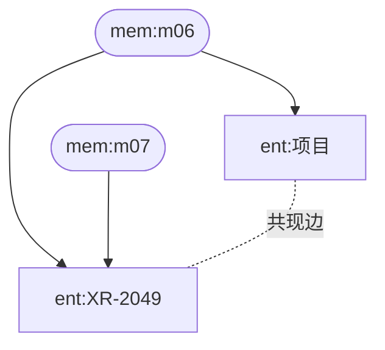
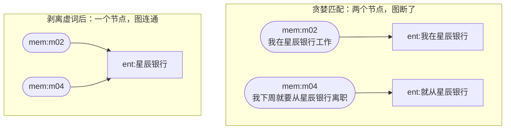
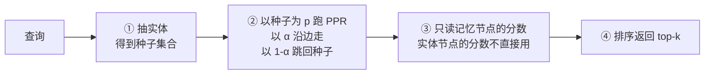

# 第四章 结构化与图记忆

> 💡 **一句话**：向量检索会「找最像的」，但不会「走一步」。多跳问题要的是后者。
>
> ⏱ 约 40 分钟　|　难度 ●●○　|　前置：第 3 章　|　💻 `python -m minimem.learn ch04`
>
> **学完你能**
> 1. 说清楚为什么多跳查询是向量检索的结构性弱点，而不是调参能解决的问题。
> 2. 讲明白 Personalized PageRank 怎么把「顺着关系走」变成一次矩阵迭代。
> 3. 判断图记忆在什么场景下值得付出它的代价，什么场景下不值得。
> 4. 识别「枢纽节点稀释分数」和「实体空间失配」这两个真实的坑。
>
> **主线产出**：`minimem/graph.py` 的 `GraphMemory`。
>
> **本章实验**：三个，各几秒，全部离线，无需 API Key。

---

## 4.1 先把问题定准

第 3 章的分能力表里有一行很扎眼：

```
  能力            BufferMemory   Vector+fake   Vector+真实
  ----------------------------------------------------
  多跳                  75%           50%           50%
```

**语义向量在多跳查询上，比第 1 章的字面匹配还差。**

看看那道题的形状：

```
「我负责的那个项目带来了什么效果？」

  第一跳：「我负责的项目」 → XR-2049           （在 m06 里）
  第二跳：XR-2049 → 人工复核量下降四成          （在 m07 里）
```

向量检索做的事情是「找和整个问句最像的几条」。而 m07 那句话——「XR-2049 上线后，人工复核量下降了大概四成」——里面既没有「负责」也没有「效果」，它和问句在语义空间里并不近。

**它没有「走一步」这个动作。** 这不是相似度算得不够准，是这个方法里根本没有「顺着关系走」这个操作。

> 🤔 **先猜一猜**
>
> 如果给记忆建一张实体关系图，用图算法做检索，多跳召回率会怎样？
>
> A. 大幅提升 —— 图就是为多跳设计的
> B. 提升，但同时在别的能力上大幅退步
> C. 基本不变 —— 换个数据结构而已
>
> <details>
> <summary>想好了再展开</summary>
>
> **B。** 而且退步的幅度会让你意外。
>
> 实测：纯图检索（PPR）在**总召回率**上只有 37.5%，远低于向量方案的 86.8%。它在「同义改写」「时序」「知识更新」「归纳」四类上全是 0%。
>
> 原因下面会讲。但先记住这个数字对比——它是本章最重要的一课：**一个在某项能力上大幅领先的方案，可能在总分上惨败**。只看总分，你会直接放弃图记忆；只看多跳，你会以为它是银弹。
>
> </details>

---

## 4.2 建一张什么样的图

### 4.2.1 节点与边

`GraphMemory` 建的是一张**二部图加实体共现图**：



- **记忆节点**（`mem`）：每条记忆一个。
- **实体节点**（`ent`）：从记忆里抽出来的实体。
- **记忆—实体边**：这条记忆提到了这个实体。**这条边让分数最终能落回记忆**。
- **实体—实体边**：同一条记忆里共现，权重是共现次数。

m06 和 m07 之间没有直接的边，但它们通过 `XR-2049` 这个实体连在了一起。**这就是「走一步」的物理基础。**

### 4.2.2 实体从哪来

规则抽取（`minimem/utils/entities.py`），零依赖零成本：

| 模式 | 例子 |
| :--- | :--- |
| 英文/数字标识符 | `XR-2049`、`FeatBase` |
| 书名号 | 《证券分析》 |
| 带后缀的机构名 | 星辰银行、长风科技、枫林小区 |
| 姓氏 + 称呼 | 李姐 |
| 领域词表 | 过敏、花生、风控、爬山…… |

写这套规则时踩到的坑值得单独说，因为它决定了图能不能连起来：

**贪婪匹配会把实体切成不同的名字。** 最初的模式 `[一-鿿]{2,6}(?:银行)` 在「我在星辰银行工作」上匹配出「我在星辰银行」，在「我下周就要从星辰银行离职」上匹配出「就从星辰银行」。两个不同的字符串 → 两个不同的节点 → **m02 和 m04 在图上根本不相连**。

修法是限制前缀长度并逐字剥离虚词：

```python
while len(name) > 2 and name[0] in _PREFIX_NOISE:
    name = name[1:]
```



这就是**实体消解**的最原始形态。真实系统里它要复杂得多（别名、缩写、指代），而且**错误会级联**——一个没消解好的实体，会让所有依赖它的多跳查询失败。

规则版抓不到的东西也很明确：「毛毛」（猫名）、「灵山」（地名）这类没有标志性后缀的裸专名。实验三会量化这个差距。

---

## 4.3 Personalized PageRank：把「走一步」变成算术

### 4.3.1 机制

普通 PageRank 假设一个随机游走者在图上乱走，每一步以概率 $\alpha$ 沿边走、以 $1-\alpha$ 随机跳转。稳态分布就是每个节点的重要性。

**Personalized** PageRank 只改一件事：随机跳转不是跳到任意节点，而是**跳回种子集合**。

$$
\mathbf{r} = \alpha \mathbf{W} \mathbf{r} + (1 - \alpha)\mathbf{p}
$$

其中 $\mathbf{p}$ 是种子分布（查询里抽出的实体），$\alpha$ 是阻尼系数。结果 $\mathbf{r}$ 就是「从这些种子出发，分数流到各处的多少」。

检索流程因此变成四步：

1. 从查询里抽实体 → 种子
2. 以种子为 $\mathbf{p}$ 跑 PPR
3. 读取**记忆节点**的分数
4. 排序返回



第三步是关键：分数在实体之间流动，但**最终必须落回记忆节点**才能返回给用户——这就是 4.2.1 里那条「记忆—实体边」的作用。

### 4.3.2 看着它传播

```bash
python docs/chapter4/code/02_ppr_and_the_trap.py
```

```
    查询：我负责的那个项目带来了什么效果？
    抽到的种子实体：['项目']

    分数传播到的实体（前 8 个）：
      0.28646  [种子] 项目
      0.19242  [传播] xr-2049
      0.16275  [传播] 反欺诈模型
      0.16275  [传播] 反欺诈
      0.00001  [传播] 风控
      0.00000  [传播] 星辰银行
```

分数从「项目」流到「XR-2049」，再流到「反欺诈」。一跳掉约 33%，**两跳之后掉了四个数量级**。

这个衰减由 $\alpha$ 控制。$\alpha$ 越大传播越远（多跳能力越强），但也越容易跑偏到无关区域。0.85 是 PageRank 的经典取值。

### 4.3.3 效果

```bash
python docs/chapter4/code/01_multihop.py
```

```
  方案                       总召回@5
  --------------------------------
  vector（第 3 章）           86.8%
  graph-ppr（纯图）           37.5%
  graph-hybrid            90.3%

  分能力召回率@5
  能力            vector      graph-ppr    graph-hybrid
  ----------------------------------------------------
  直接检索          100%          50%          100%
  同义改写           70%           0%           70%
  专有名词          100%         100%          100%
  多跳             50%          50%           75%
  时序            100%           0%          100%
  知识更新           83%           0%          100%
  归纳             83%           0%           83%
  拒答            100%         100%          100%
```

逐题看那两道多跳题：

```
    Q q10: 我负责的那个项目带来了什么效果？   需要同时召回 ['m06', 'm07']
      vector             50%  命中 ['m06']
      graph-ppr         100%  命中 ['m06', 'm07']     ← 图赢了
      graph-hybrid      100%  命中 ['m06', 'm07']

    Q q11: 我的领导要去哪？                需要同时召回 ['m24', 'm26']
      vector             50%  命中 ['m24']
      graph-ppr           0%  （一条 gold 都没召回）    ← 图输了
      graph-hybrid       50%  命中 ['m24']
```

**q10 是图该赢的地方，它赢了。** 「项目」在查询里，PPR 顺着「项目 → XR-2049 → 复核量」把两条 gold 都拿了回来。

**q11 是图完全失效的地方。** 「我的领导要去哪？」——「领导」不是一个能被抽出的实体（不是专名，也不在词表里），PPR 连种子都没有，直接返回空。

---

## 4.4 纯图检索为什么总分那么低

37.5% 这个数字需要解释，因为它决定了你该怎么用图记忆。

**根因只有一个：查询里必须有可锚定的实体。**

而日常提问里大量使用泛称、代词和描述性短语：

| 查询 | 能抽出实体吗 |
| :--- | :--- |
| 「XR-2049 是什么项目？」 | ✅ XR-2049 |
| 「我平时业余时间干什么？」 | ❌ 全是泛称 |
| 「跟我沟通有什么要注意的？」 | ❌ |
| 「我的领导要去哪？」 | ❌ 「领导」不是专名 |

抽不出种子 → PPR 无从下手 → 返回空。于是「同义改写」「归纳」这些依赖泛化理解的能力全部归零。

**这就是 `GraphMemory` 默认用 `hybrid` 而不是纯 `ppr` 的原因**：向量通道负责兜住这类查询，图通道负责多跳。两者的失效场景恰好互补。

> ✅ **检查点 4.4**
>
> 为什么纯图检索在「同义改写」类查询上得分是 0，而不是「差一些」？
>
> <details>
> <summary>参考答案</summary>
>
> 因为它不是「效果差」，是**根本没有输出**。同义改写类查询（「我平时业余时间干什么？」）里没有任何可抽取的实体，PPR 没有种子就无法启动，`_ppr_rank` 返回空列表。
>
> 这和「召回了但排序不好」是两种完全不同的失败，前者靠调参救不回来，只能靠另一条通道兜底。
>
> </details>

---

## 4.5 一个我们已经踩过一次的坑

> 🤔 **先猜一猜**
>
> PPR 会给图上每个连通节点分配一点分数。把 PPR 通道和向量通道用 RRF 融合时，那些分数近乎为零的节点会造成什么影响？
>
> A. 没影响 —— 它们分数太低，排在后面
> B. 会挤掉向量通道里真正相关的结果
>
> <details>
> <summary>想好了再展开</summary>
>
> **B。而且这正是第 3 章 BM25 通道的那个问题，换了个通道又出现了一次。**
>
> 关掉门槛时，PPR 通道返回的前 5 个是：
>
> ```
>     1. [m06] 0.16274521  我负责的项目代号是 XR-2049…
>     2. [m07] 0.03271012  XR-2049 上线后，人工复核量下降四成
>     3. [m01] 0.00000297  你好，我叫小明。
>     4. [m11] 0.00000297  我对花生过敏…
>     5. [m12] 0.00000297  我喜欢周末去爬山…
> ```
>
> 第 3 名往后的分数比第 1 名小五个数量级，内容完全无关。单看 PPR 通道无所谓，但 **RRF 只看名次**——「PPR 的第 3 名」和「向量的第 3 名」权重完全相同。
>
> </details>

修法和第 3 章一模一样：给通道内的候选设相对门槛。

```
  门槛消融（hybrid 模式）：
    floor            总召回@5        多跳
    --------------------------------
    0.0             88.2%       50%
    0.001           90.3%       75%
    0.01            90.3%       75%    ← 默认
    0.1             90.3%       75%
```

多跳从 50% 回到 75%，总召回从 88.2% 到 90.3%。

> **值得记住的规律**
>
> 任何要参与 RRF 融合的通道，都必须先把自己的低质量候选清理干净。
> 因为融合看的是名次，而名次不区分「第 3 名很好」和「第 3 名很差」。

注意 PPR 的门槛值（0.01）比 BM25 的（0.5）小两个数量级——因为 PPR 分数按跳数指数衰减，二跳邻居天然就比种子低很多。**门槛要按通道自身的分数分布来定，不能照抄。**

---

## 4.6 图记忆的代价

```bash
python docs/chapter4/code/03_extraction_cost.py
```

```
  抽取方式                   实体节点     边    没抽到实体
  ------------------------------------------------
  规则抽取                       42     81         6
  LLM 抽取（模拟）                44     96         4

  抽取方式               总召回@5    多跳   写入耗时(s)  LLM 调用   token
  ------------------------------------------------------------------
  规则抽取                90.3%    75%      0.45        0       0
  LLM 抽取（模拟）          88.2%    50%      0.11       62    6279

  按占位价格估算，抽取 30 条记忆的 LLM 成本：$0.000942
  折算到每万条记忆：约 $0.31
```

### 4.6.1 一个反直觉的结果

LLM 抽取建了一张**更密的图**（实体更多、边更多、没抽到实体的记忆从 6 降到 4），但它的多跳召回率**比规则版还低**。

原因值得记住：查询「我负责的那个项目」的种子是「项目」这个**泛称**，而 LLM 抽取把 XR-2049 和 XR-2050 **都**连到了「项目」节点上。PPR 从「项目」出发时分数被两个项目均分，于是 m08（XR-2050，一跳就到记忆）压过了 m07（XR-2049 的效果，要走两跳）。

**枢纽节点会稀释分数。** 连接越多的实体，从它出发的传播就越发散。HippoRAG 用 node specificity（类似 IDF，给高频节点降权）缓解这个问题——本章的 🟡 挑战留了这个实现。

更一般的结论：

> **「更好的抽取」不等于「更好的检索」。**
> 图的效果取决于抽取质量、图结构、查询锚定三者的配合，
> 单独优化其中一个，另外两个可能反过来拖后腿。

这和第 3 章「换成向量检索这个架构动作本身不带来任何东西」是同一类教训。

### 4.6.2 三块成本

**第一块：抽取。** 规则版免费，LLM 版每条记忆一次调用。上面的金额看着小是因为只有 30 条记忆——**折算到每万条**那一行才是要看的数字，而一个活跃用户一年就能产生上万条。

**第二块：检索。** PPR 每次要在整张图上做幂迭代。图越大越慢，而且它不像向量检索那样能靠 ANN 索引降复杂度。

**第三块：人工，也是最容易被忽略的一块。** 本章的 `RuleExtractor` 里有一份领域词表、一份姓氏表、一份前缀噪声表——换个业务领域全都要重写。这份成本不出现在账单上，但它真实存在，而且**不会随规模摊薄**。

### 4.6.3 关于 GraphRAG 一类方案的成本

⚠️ 本章实现的是最轻量的图记忆。业界的完整方案要重得多：

- **GraphRAG**（Microsoft）在实体图之上还要做**社区检测 + 社区摘要**，每个社区一次 LLM 调用。
- **LightRAG** 做双层检索（局部实体 + 全局主题），并支持增量更新。

📄 相关工作报告的 prompt 长度可达 **10⁴ token 量级**，显著高于 vanilla RAG。在决定上图记忆之前，先算清楚你的读写比。

---

## 4.7 这一族方案的地图

| 方案 | 核心机制 | 适合什么 | 主要代价 |
| :--- | :--- | :--- | :--- |
| **RAPTOR**（ICLR 2024） | GMM 软聚类 + LLM 摘要，建一棵树；检索时在树上做 beam search | 需要不同抽象层次的问答 | 建树时大量 LLM 摘要调用 |
| **GraphRAG**（Microsoft, 2024） | 实体图 + 社区检测 + 社区摘要 | 全局性问题（「这批文档主要在讲什么」） | prompt 长度可达 10⁴ token 量级 |
| **LightRAG**（2024） | 双层检索（局部实体 + 全局主题）+ 增量更新 | 需要频繁更新的语料 | 仍需 LLM 抽取 |
| **HippoRAG**（📄 arXiv:2405.14831, NeurIPS 2024） | OpenIE 建实体图 + Personalized PageRank | 多跳问答 | 抽取成本 + 实体消解 |
| **HippoRAG 2** | dense-sparse 编码 + query-to-triple 匹配 | 同上，锚定更准 | 同上 |
| 本章的 `GraphMemory` | 规则/LLM 抽取 + PPR + 向量融合 | 教学；小规模记忆场景 | 见 4.6 |

关于 HippoRAG 的效果，📄 论文原文报告：相比当时的基线方法提升「up to 20%」，同时「10-30 times cheaper and 6-13 times faster」（相对于需要多次 LLM 调用的迭代式检索方案）；在 2WikiMultiHopQA 上 Recall@5 从 ColBERTv2 的 68.2 提升到 89.1。

这些数字来自论文自报的实验条件，与你的场景是否可比，取决于 4.6.1 节说的那三者配合。

---

## 4.8 代价与选型

| 方案 | 写入代价 | 检索代价 | 依赖 | 什么时候选 |
| :--- | :--- | :--- | :--- | :--- |
| `VectorMemory`（第 3 章） | 1 次编码 | 1 次矩阵乘 | 嵌入模型 | 默认选择 |
| `GraphMemory` + 规则抽取 | 编码 + 正则 | PPR 迭代 + 矩阵乘 | networkx | 多跳需求明确，且实体有明显标志 |
| `GraphMemory` + LLM 抽取 | + 每条 1 次 LLM | 同上 | LLM API | 实体无标志（人名、地名多），且读写比高 |
| GraphRAG 类完整方案 | + 社区摘要 | 长 prompt | 重 | 全局性问答，预算充足 |

**决策顺序建议**：

1. 先用第 3 章的向量方案跑一遍，**看分能力表**。
2. 如果多跳那一行明显偏低，且你的业务确实有多跳需求 → 考虑图记忆。
3. 先上规则抽取。它免费，而且能告诉你实体抽取的天花板在哪。
4. 只有当「没抽到实体的记忆」比例高得离谱时，才换 LLM 抽取——并且**换完要重测**，因为 4.6.1 节的现象可能发生。
5. 无论如何都用 `hybrid` 模式。纯图检索的失效场景太常见了。

---

## 4.9 常见误区

**误区一：「图记忆比向量检索更强」**

4.3.3 节的实测：纯图检索总召回 37.5%，纯向量 86.8%。图强的是多跳这一项，其他项它可能根本没有输出。

**误区二：「抽取质量越高，检索效果越好」**

4.6.1 节的反例：LLM 抽取建了更密的图，多跳召回反而更低。枢纽节点会稀释分数。

**误区三：「有了图就不需要向量了」**

4.4 节：日常查询里大量使用泛称与代词，抽不出实体，图检索完全失效。两条通道的失效场景互补，这正是要融合的理由。

**误区四：「PPR 的门槛是个可调优的超参数」**

4.5 节：它在修一个 bug（噪声候选劫持融合），不是在调优。而且门槛值要按通道的分数分布定，PPR 的（0.01）和 BM25 的（0.5）差两个数量级。

**误区五：「规则抽取免费」**

4.6.2 节：它的成本是人工——词表、模式、消解规则，换个领域全部重写，而且不随规模摊薄。

---

## 4.10 小结

- 多跳查询是向量检索的**结构性弱点**：它能「找最像的」，但没有「走一步」这个动作。
- 图记忆的做法是把记忆和实体建成一张图，用 Personalized PageRank 让分数沿边传播——**这就是「走一步」的数学形式**。
- 实测：多跳召回从 50% 提升到 75%，总召回 86.8% → 90.3%。但**纯图检索总分只有 37.5%**，因为大量查询抽不出种子实体。所以默认必须用混合模式。
- 第 3 章的 RRF 陷阱在 PPR 通道**又出现了一次**。规律：任何参与融合的通道都要先清理自己的低质量候选，且门槛要按该通道的分数分布来定。
- **「更好的抽取」不等于「更好的检索」**：LLM 抽取建了更密的图，多跳反而更差，因为枢纽节点稀释了分数。
- 图记忆有三块成本：抽取（LLM 调用）、检索（PPR 迭代）、**人工（词表与消解规则，不随规模摊薄）**。

第 1 章的三堵墙，到这里推倒了一堵半。**知识演化那堵墙仍然立着**——`GraphMemory` 依然会把「星辰银行」和「长风科技」两条矛盾的事实一起返回，而且现在它们还在图上连在一起，看起来更「相关」了。

---

## 🔧 动手挑战

**🟢 五分钟**

把 `GraphMemory` 的 `damping` 从 0.85 依次改成 0.5 和 0.99，重跑实验二，观察分数传播的距离怎么变。

- 起点：`docs/chapter4/code/02_ppr_and_the_trap.py` 里 `build()` 的参数
- 做对了会看到：damping 小的时候分数几乎不出种子，大的时候传得很远但也更发散

**🟡 半小时到一小时**

实现 **node specificity**：给实体节点按「它连接了多少条记忆」降权（类似 IDF），抑制枢纽节点稀释分数的问题。然后重跑实验三，看 LLM 抽取版的多跳召回能不能超过规则版。

- 起点：`minimem/graph.py` 的 `_ppr_rank`，修改 `personalization` 的权重分配
- 做对了会看到：q10 在 LLM 抽取版下召回率回到 100%
- 验证：`python -m pytest tests/test_graph.py -q`

**🔴 半天以上**

给 `GraphMemory` 加**实体消解**：把「星辰银行」「星辰」「那家银行」合并成同一个节点。可以用向量相似度做候选、用规则或 LLM 做判定。然后测量它对多跳召回的影响，以及它引入的错误合并率。

- 做对了会看到：合并率与错误合并率的权衡曲线——**这条曲线才是实体消解的真实难度所在**

---

## 🧠 复习卡片

<details>
<summary>为什么多跳查询是向量检索的结构性弱点？</summary>

因为向量检索做的是「找和整个问句最像的几条」，它没有「走一步」这个动作。多跳问题的第二跳记忆（比如「XR-2049 上线后复核量下降四成」）在语义上离问句很远，排不进前列。换更大的嵌入模型也解决不了，因为这不是相似度算得准不准的问题。
</details>

<details>
<summary>Personalized PageRank 和普通 PageRank 差在哪？为什么这个差别对检索重要？</summary>

只差一件事：随机跳转不是跳到任意节点，而是跳回**种子集合**。种子来自查询里抽出的实体。这让分数从「查询相关的位置」出发沿边传播，一跳、两跳地衰减扩散——这就是「顺着关系走」的数学形式。
</details>

<details>
<summary>纯图检索的总召回率为什么那么低（实测 37.5%）？</summary>

因为它要求查询里有可锚定的实体，而日常提问大量使用泛称、代词、描述性短语（「我平时业余时间干什么？」「我的领导要去哪？」）。抽不出种子，PPR 就无法启动，直接返回空——这不是「效果差」而是「没有输出」。所以图记忆必须配向量通道兜底。
</details>

<details>
<summary>「更好的抽取」为什么不一定带来「更好的检索」？</summary>

实测：LLM 抽取建了更密的图（实体更多、边更多），多跳召回反而从 75% 掉到 50%。因为它把多个项目都连到了「项目」这个泛称节点上，PPR 从枢纽节点出发时分数被均分，二跳的正确答案竞争不过一跳的无关结果。图的效果取决于抽取质量、图结构、查询锚定三者的配合。
</details>

<details>
<summary>为什么 PPR 通道的融合门槛（0.01）比 BM25 通道的（0.5）小两个数量级？</summary>

因为 PPR 分数按跳数**指数衰减**——二跳邻居天然就比种子低几个数量级，而它们往往是正确答案。BM25 的分数分布则平缓得多。门槛必须按通道自身的分数分布来定，照抄另一个通道的值会把真结果一起滤掉。
</details>

---

## 🚪 下一章

`GraphMemory` 现在能顺着关系走了。但它仍然不知道**哪条事实已经过期**——而且更糟的是，矛盾的事实现在还在图上连在了一起，看起来比以前更「相关」。

「我在星辰银行工作」和「我下个月入职长风科技」，哪条是现在有效的？

→ **第 5 章：给记忆装上时间轴。**

---

## 参考文献

1. 📄 Gutiérrez, B. J., et al. *HippoRAG: Neurobiologically Inspired Long-Term Memory for Large Language Models*. arXiv:2405.14831, NeurIPS 2024. （本章 PPR 检索的主要来源）
2. 📄 Sarthi, P., et al. *RAPTOR: Recursive Abstractive Processing for Tree-Organized Retrieval*. ICLR 2024.
3. 📄 Edge, D., et al. *From Local to Global: A Graph RAG Approach to Query-Focused Summarization*. Microsoft, 2024.
4. 📄 Guo, Z., et al. *LightRAG: Simple and Fast Retrieval-Augmented Generation*. 2024.
5. 📄 Page, L., Brin, S., et al. *The PageRank Citation Ranking*. 1998. （PPR 的源头）
6. 📄 Cormack, G. V., et al. *Reciprocal Rank Fusion*. SIGIR 2009. （本章融合仍用它）

> **本章数字的可信度说明**：4.3~4.6 节的全部表格来自本章脚本在单机 CPU 上的实测，可复现。
> 4.7 节引用的 HippoRAG 数字为 📄 论文原文自报，实验条件见原文。
> MiniBench 只有 30 条记忆、24 个查询，多跳类只有 2 题——**「多跳从 50% 到 75%」实际上只是一道题的差别**，
> 它能支撑「方向」但绝不能支撑「幅度」。
