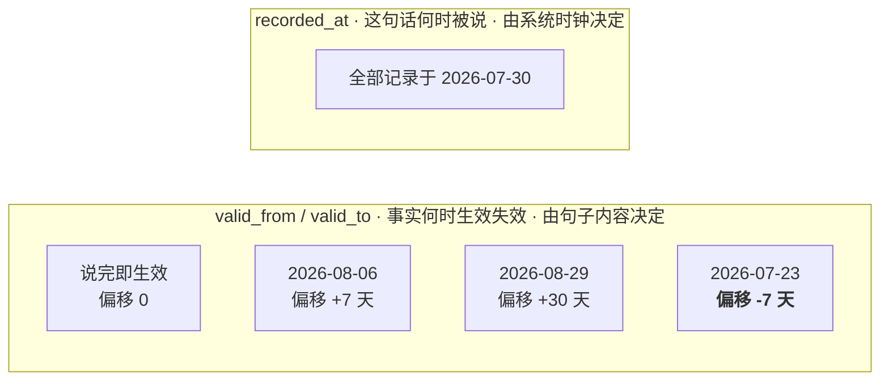
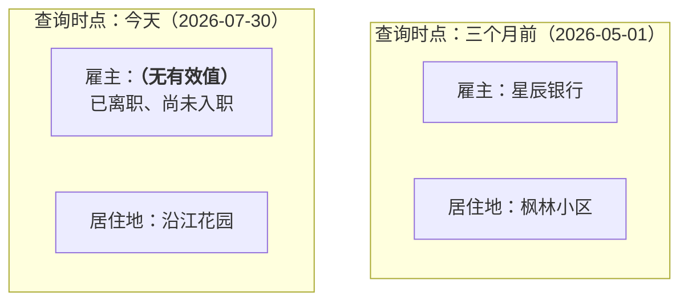
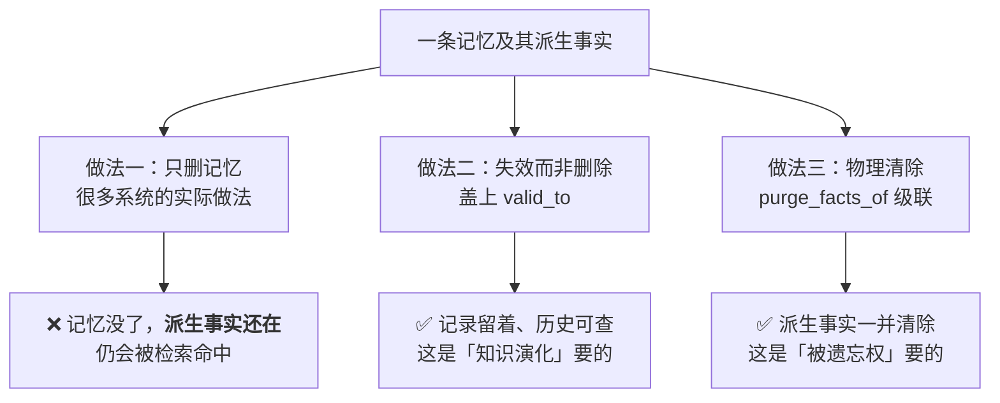

# 第五章 时间感知与知识演化

> 💡 **一句话**：说话的时间和事实生效的时间是两回事。混为一谈，时序问答必错。
>
> ⏱ 约 35 分钟　|　难度 ●●○　|　前置：第 4 章　|　💻 `python -m minimem.learn ch05`
>
> **学完你能**
> 1. 说清楚 bi-temporal 的两条时间轴各自记录什么，为什么必须分开。
> 2. 实现「事实失效」而不是删除，并解释为什么不能删。
> 3. 回答「三个月前他在哪工作」这类时点问题。
> 4. 说明 provenance 为什么是删除权、审计、投毒防御三件事的共同基础。
>
> **主线产出**：`minimem/temporal.py` 的 `TemporalGraphMemory`。
>
> **本章实验**：两个，各几秒，全部离线。

---

## 5.1 第三堵墙

第 1 章测出 `BufferMemory` 的三堵墙。第 3 章推倒了语义鸿沟，第 3、4 章把规模天花板推远了。**第三堵原封不动**：

```
Q: 我在哪家公司上班？
   我在星辰银行工作。              ← 半年前说的
   我下周就要从星辰银行离职了。      ← 二十天前说的
   新工作定了，下个月入职长风科技。   ← 半个月前说的
```

三条都是真话，都被召回了，而且第 4 章的图记忆还把它们连得更紧密了——「星辰银行」和「长风科技」都挂在「用户」这个节点上，看起来**更相关**了。

模型拿到这三条，只能猜。

> 🤔 **先猜一猜**
>
> 假设今天是 2026-07-30，上面三句话分别说于半年前、二十天前、半个月前。
> 「我在哪家公司上班？」的正确答案是什么？
>
> A. 星辰银行 —— 那是他明确说过在工作的地方
> B. 长风科技 —— 那是最新的信息
> C. 都不是
>
> <details>
> <summary>想好了再展开</summary>
>
> **C。**
>
> 「下周离职」说于 7-10，生效于 **7-17**——已经过去了。
> 「下个月入职」说于 7-15，生效于 **8-14**——还没到。
>
> 所以在 7-30 这一天，**他既不在星辰银行，也还没到长风科技**。正确答案是「已离职，下月入职长风科技」。
>
> 选 B 是最常见的直觉，也是绝大多数「取最新记忆」策略会给出的答案。它错在把**说话时间**当成了**生效时间**。
>
> </details>

---

## 5.2 两条时间轴

### 5.2.1 它们记录的不是同一件事

```bash
python docs/chapter5/code/01_two_timelines.py
```

| 时间轴 | 记录什么 | 谁决定 |
| :--- | :--- | :--- |
| `recorded_at` | 这句话**什么时候被说的** | 系统时钟 |
| `valid_from` / `valid_to` | 这个事实**什么时候生效/失效** | 句子的内容 |

第 1 章的 `MemoryItem.created_at` 只有前者。当时留了一句伏笔：

> 注意这是**记录时间**，不是事实**发生时间**，两者的区别是第 5 章双时间轴的核心。

现在兑现它。实测（假设都说于 2026-07-30）：

```
      「我在星辰银行工作。」→ 说完即生效
      「我下周就要从星辰银行离职了。」→ 生效于 2026-08-06（+7 天）
      「新工作定了，我下个月入职长风科技。」→ 生效于 2026-08-29（+30 天）
      「上周搬家了，现在住城东的沿江花园。」→ 生效于 2026-07-23（-7 天）
```



四句话的 `recorded_at` 完全相同，`valid_from` 却散在一个月的跨度里。**最后一条的偏移是负的**——「上周搬家了」在描述一件已经发生的事，生效时间早于说话时间。任何只有单条时间轴的设计都表达不了这一点。

注意最后一条：**生效时间可以早于说话时间**。「上周搬家了」是在描述一件已经发生的事。

这套机制的来源是 Zep/Graphiti（📄 arXiv:2501.13956），它把事实的生效/失效时间与来源 episode 作为一等字段。

### 5.2.2 事实的演化史

有了两条时间轴，同一个属性的变化就能画成一条线：

```
    「雇主」的演化：
      雇主=星辰银行  [生效 2026-01-31 · 记录 2026-01-31 · 已失效于 2026-07-17]
      雇主=星辰银行  [生效 2026-07-17 · 记录 2026-07-10 · 说话与生效相差 +7 天
                     · 终止事件，于 2026-07-17 结束此项]
      雇主=长风科技  [生效 2026-08-14 · 记录 2026-07-15 · 说话与生效相差 +30 天 · 有效]

    「居住地」的演化：
      居住地=枫林小区  [生效 2026-02-20 · 记录 2026-02-20 · 已失效于 2026-07-13]
      居住地=沿江花园  [生效 2026-07-13 · 记录 2026-07-20 · 说话与生效相差 -7 天 · 有效]
```

于是「今天有效的事实」变成一个可以精确计算的东西：

```
    今天（2026-07-30）有效的事实：
      姓名=小明
      过敏原=花生
      居住地=沿江花园
      上级=李姐
```

**「雇主」不在列表里。** 这不是 bug，这是正确答案——用户已离职、尚未入职。

### 5.2.3 时点查询



同一个问题，两个时点，两个不同的正确答案。

> **这里有个容易被忽略的点**：没有时间轴，「我三个月前住哪」这个问题**根本无解**。
> 不是「答得不准」，是系统里没有任何信息能回答它——旧记忆要么被删了，要么和新记忆混在一起无法区分。

> ✅ **检查点 5.2**
>
> 「上周搬家了，现在住城东的沿江花园」这句话，`recorded_at` 和 `valid_from` 哪个更早？为什么这个方向也要支持？
>
> <details>
> <summary>参考答案</summary>
>
> `valid_from` 更早（早 7 天）。因为这句话在**描述一件已经发生的事**。
>
> 如果只支持「生效时间 ≥ 说话时间」，那么「上周搬家了」会被记成「今天搬家」，于是「上周他住哪」就会答错。人在对话里追述过去和预告未来一样常见，两个方向都要支持。
>
> </details>

---

## 5.3 失效，而不是删除

### 5.3.1 为什么不能删

新事实来了，旧事实怎么办？直觉是覆盖或删除。**都不对。**

因为「他三个月前在哪工作」仍然是一个合法的问题。删掉旧事实，你就永久失去了回答它的能力。

`TemporalGraphMemory` 的做法是给旧事实盖一个 `valid_to`：

```python
def _invalidate_conflicts(self, facts, new, *, terminal):
    for old in facts:
        if old.predicate != new.predicate or old.valid_to is not None:
            continue
        if not terminal and old.object == new.object:
            continue  # 重复陈述同一件事，不算冲突
        old.valid_to = new.valid_from  # 划上句号，但记录留着
        old.invalidated_by = new.fid  # 记下是谁让它失效的
```

### 5.3.2 终止型事件

有一类句子不产生新事实，只是给旧事实划句号：

- 「我从星辰银行离职了」→ 雇主这一项**结束**，但没有新值
- 「我搬走了」→ 居住地结束

代码里用 `terminal` 标记它们。这类事件在实践中很容易被漏掉——多数抽取器只认「A 是 B」这种模式，不认「A 不再是 B」。**漏掉的后果是旧事实永远有效**。

### 5.3.3 这条冲突规则的局限

```python
# 规则：同一个 predicate 上，旧的有效事实在新事实生效时终止
```

**它假设一个属性同时只能有一个值。** 对「雇主」「居住地」成立，对「爱好」「技能」「过敏原」就不成立——一个人可以同时喜欢爬山和读书，也可以同时对花生和海鲜过敏。

真实系统需要区分**单值属性**与**多值属性**。而这个判断本身往往需要 LLM，或者一份人工维护的 schema——又一处第 4 章说的「不出现在账单上的人力成本」。

本模块的规则式实现在这里是**故意留短**的：第 6 章接上 LLM 之后会重新处理冲突判定，并把它引入的新问题（判断错了怎么办）一并算进去。

---

## 5.4 provenance：一个字段，三个用途

```bash
python docs/chapter5/code/02_provenance.py
```

每条事实记录 `source_episode`——它从哪条原始记忆抽出来的。这一个字段同时解决三个问题。

### 用途一：回查

```
    过敏原=花生
      ← 我对花生过敏，点餐要特别注意。
```

模型说「你对花生过敏」，你能立刻查到这是哪句话推出来的。**这是可解释性最低成本的实现方式**——不需要任何模型内部信息。

### 用途二：审计

```
    雇主=星辰银行  [生效 2026-01-31 · 已失效于 2026-07-17]
      失效原因 ← 我下周就要从星辰银行离职了，交接已经开始。
```

用户问「你为什么认为我在长风科技工作」，你答得出来。模型答错时，你能定位是抽取错了、冲突判定错了，还是检索错了。

### 用途三：级联删除

第 10 章要求删除必须级联到派生数据。这一章第一次真正实现它：

```python
def _delete(self, memory_id, *, user_id):
    super()._delete(memory_id, user_id=user_id)
    for fact in self._facts.get(user_id, []):
        if fact.source_episode == memory_id and fact.valid_to is None:
            fact.valid_to = self.now()
            fact.invalidated_by = "__deleted__"
```

### 5.4.1 失效 ≠ 删除

实验二演示了两种做法的区别：

```
    ── 做法一：只删记忆（很多系统实际做的） ──
       事实仍在：['过敏原=花生']
         过敏原=花生 → 已失效

    ── 做法二：物理清除（被遗忘权要求的） ──
       purge_facts_of 清除了 1 条派生事实，剩余 0 条
```

**「不再检索」和「不再存在」是两回事。** 把前者当成后者，在合规上是事故。

而且真实系统的级联清单还要长得多：

| 派生数据 | 删除时要处理 |
| :--- | :--- |
| 向量缓存 | 不删会仍被最近邻命中 |
| 图上的边与孤儿实体节点 | 第 4 章的 `_detach` 做了这件事 |
| 倒排索引 | |
| 从事实再派生的摘要 | 第 7 章会产生这类数据 |
| 备份与日志 | **几乎总是被忽略** |



**每加一种派生数据，删除路径就要加一处。** 这就是为什么「删除必须是真删除」在记忆系统里格外难。

注意做法二和做法三**不是二选一**：前者服务于「三个月前他在哪上班」，后者服务于合规删除。真实系统两个都要。

---

## 5.5 一个诚实的评测结果

把 `TemporalGraphMemory` 放进 MiniBench，和第 4 章的 `GraphMemory` 比：

```
    方案                    总召回      时序    知识更新      多跳    直接检索
    ----------------------------------------------------------------
    graph（第 4 章）        90.3%     100%     100%      75%     100%
    temporal（本章）        90.3%     100%     100%      75%     100%
```

**召回率一模一样，没有任何提升。**

这不是实现有问题，而是**指标测不到这一章做的事**。

时序处理改善的不是「能不能召回相关记忆」——那三条关于工作的记忆，两种实现都能召回。它改善的是：

1. **召回之后怎么排序**（当前有效的排前面）
2. **怎么告诉模型哪条有效**（`answer_context` 注入时间与状态）
3. **能否回答时点问题**（「三个月前」——召回率指标里根本没有这道题）

这是第 10 章那句话的又一个例证：

> **检索指标测不到端到端效果。**

要衡量时序能力，你需要的是「回答是否正确」，而那需要真实 LLM 参与评测，还要面对第 10 章说的评判宽松问题。

### 5.5.1 那么它到底改善了什么

对比一下喂给模型的上下文。第 4 章：

```
  我在星辰银行工作，是一名信贷风控工程师。
  新工作定了，我下个月入职长风科技，做风控算法。
  我下周就要从星辰银行离职了，交接已经开始。
```

本章的 `answer_context`：

```
  （以下信息的判断时点：2026-07-30）

  相关记忆：
    [2026-01-31 · 当时无效] 我在星辰银行工作，是一名信贷风控工程师。
    [2026-07-15 · 当时无效] 新工作定了，我下个月入职长风科技，做风控算法。
    [2026-07-10 · 当时无效] 我下周就要从星辰银行离职了，交接已经开始。

  当前有效的事实：
    姓名：小明（自 2026-01-31）
    过敏原：花生（自 2026-02-10）
    居住地：沿江花园（自 2026-07-13）
```

模型现在**有判断依据**了。这也正是第 10 章讲投毒防御时说的「让上下文带上来源」——那一节列的防御手段，实现就在这里。

---

## 5.6 代价与选型

| 方案 | 写入代价 | 检索代价 | 能回答什么 | 什么时候需要 |
| :--- | :--- | :--- | :--- | :--- |
| `VectorMemory` | 1 次编码 | 1 次矩阵乘 | 「他提过什么」 | 事实基本不变 |
| `GraphMemory` | + 抽实体 | + PPR | 「顺着关系找」 | 有多跳需求 |
| `TemporalGraphMemory` | + 抽事实 + 冲突检测 | + 时点过滤 | **「他现在怎样」「三个月前怎样」** | 状态会变、需要审计 |

时序层的额外开销：

- **写入**：每条记忆多一次事实抽取（规则版免费，LLM 版一次调用）+ 一次冲突扫描（O(已有事实数)，可以用按 predicate 建索引降到 O(1)）
- **存储**：事实表随时间只增不减（因为失效的要留着）。需要归档策略——比如把五年前失效的事实移到冷存。
- **检索**：多一次时点过滤，开销可忽略

**什么时候不需要这一章**：如果你的记忆内容基本是静态的（产品手册、法规），或者你只关心「当前状态」且能接受偶尔答错，那么按时间取最新一条就够了。**时序层是为「状态会变且变化本身重要」的场景准备的**——客服（订单状态）、健康（用药史）、金融（持仓）、HR（职位变动）。

---

## 5.7 常见误区

**误区一：「按时间戳取最新的就行」**

5.1 节的反例：「下个月入职长风科技」的时间戳最新，但它描述的是未来。取最新会给出错误答案。

**误区二：「新事实来了就覆盖旧的」**

5.3.1 节：覆盖会让「三个月前他在哪工作」永久无解。正确做法是失效而非删除。

**误区三：「一个属性只有一个值」**

5.3.3 节：对「雇主」成立，对「爱好」「过敏原」不成立。需要区分单值与多值属性，而这个判断本身需要 schema 或 LLM。

**误区四：「删了记忆就等于删了信息」**

5.4.1 节：派生的事实、向量、图边、摘要都还在。**「不再检索」和「不再存在」是两回事。**

**误区五：「加了时序处理，召回率应该会涨」**

5.5 节的实测：召回率一点没变。时序改善的是排序、上下文标注和时点问答能力，而这些**召回率测不到**。

---

## 5.8 小结

- **说话时间 ≠ 事实生效时间**。「下个月入职」说于今天、生效于下月；「上周搬家了」说于今天、生效于上周。两个方向都要支持。
- 双时间轴让「今天有效的事实」成为可计算的东西——包括「当前没有有效值」这种正确但反直觉的答案。
- **冲突时失效而非删除**，因为历史查询是合法需求。终止型事件（离职、搬走）只划句号、不产生新值，而它们最容易被抽取器漏掉。
- 冲突规则「一个属性一个值」对雇主成立、对爱好不成立。**单值/多值的判断需要 schema 或 LLM。**
- `source_episode` 一个字段解决三件事：回查、审计、级联删除。
- **失效不是删除。** 被遗忘权要求物理清除，而级联清单包含向量、图边、摘要、备份——每加一种派生数据就要加一处。
- **本章的改善召回率测不到。** 这是「检索指标测不到端到端效果」最干净的一个例证。

第 1 章的三堵墙到这里全部处理完了。但一路上我们积累了一串「留给 LLM 的活」：事实抽取太弱、冲突判定太粗、单值/多值分不清、重要性无法判断。

---

## 🔧 动手挑战

**🟢 五分钟**

把实验一的判断时点改成半年后（`BASE_DATE + timedelta(days=180)`），看「雇主」和「居住地」的答案怎么变。

- 起点：`docs/chapter5/code/01_two_timelines.py` 的 `part3_point_in_time`
- 做对了会看到：雇主变成长风科技（8-14 已生效）

**🟡 半小时到一小时**

给 `Fact` 加 `multi_valued` 标记，让「过敏原」「爱好」这类属性支持多个并存的值，而「雇主」「居住地」保持单值。然后验证：说了「我对海鲜也过敏」之后，花生过敏**不应该**失效。

- 起点：`minimem/temporal.py` 的 `_invalidate_conflicts`
- 做对了会看到：`facts_at` 同时返回两条过敏原事实
- 验证：`python -m pytest tests/test_temporal.py -q`

**🔴 半天以上**

实现**置信度衰减**：一条事实越久没被重新提及，可信度越低。比如「我住在枫林小区」说于两年前且此后再无相关信息，它是否还该被当作当前有效？设计一个衰减函数，并用 MiniBench 验证它不会误伤「过敏原」这类长期稳定的事实。

- 做对了会看到：一条「事实类型 × 衰减速度」的对照表——**不同属性的时效性差别巨大**，这才是难点

---

## 🧠 复习卡片

<details>
<summary>为什么「按时间戳取最新的事实」是错的？</summary>

因为时间戳记录的是**说话时间**，而不是**事实生效时间**。「我下个月入职长风科技」时间戳最新，但它描述的是未来——今天取它会得出「他现在在长风科技」这个错误结论。反过来「上周搬家了」的生效时间早于说话时间。
</details>

<details>
<summary>冲突的事实为什么要「失效」而不是删除？</summary>

因为「他三个月前在哪工作」是合法问题。删掉旧事实就永久失去了回答它的能力。正确做法是给旧事实盖 `valid_to`，并记下 `invalidated_by`（是谁推翻的），这样历史查询和审计都还在。
</details>

<details>
<summary>「一个属性同时只有一个值」这条冲突规则什么时候会出错？</summary>

对「雇主」「居住地」这类单值属性成立，对「爱好」「技能」「过敏原」这类多值属性不成立——一个人可以同时对花生和海鲜过敏。需要区分单值与多值属性，而这个判断本身需要 schema 或 LLM 参与。
</details>

<details>
<summary>provenance（source_episode）一个字段解决了哪三件事？</summary>

回查（这个结论从哪句话来）、审计（这条事实为什么失效）、级联删除（删原始消息时派生事实要一起处理）。它也是第 10 章投毒防御里「让上下文带上来源」的实现基础。
</details>

<details>
<summary>为什么加了时序处理，MiniBench 的召回率一点没涨？</summary>

因为召回率测不到这一章做的事。相关记忆两种实现都能召回；时序改善的是**排序**（当前有效的排前面）、**上下文标注**（告诉模型哪条有效）和**时点问答**（「三个月前」这道题召回率指标里根本没有）。这是「检索指标测不到端到端效果」最干净的例证。
</details>

---

## 🚪 下一章

第 1 章的三堵墙全部处理完了。但这五章一路积累了一串「留给 LLM 的活」：

- 事实抽取靠正则，抓不到没有标志的专名（第 4 章）
- 冲突判定靠「一个属性一个值」，分不清单值多值（本章）
- 什么记忆值得钉住、值得抽取，无从判断（第 2、4 章）

这些都需要**判断力**，而规则给不了判断力。

→ **第 6 章：让记忆自己组织自己——以及为此付出的第一笔真金白银。**

---

## 参考文献

1. 📄 Rasmussen, P., et al. *Zep: A Temporal Knowledge Graph Architecture for Agent Memory*. arXiv:2501.13956. （bi-temporal 与 provenance 的主要来源）
2. 📄 Zhang, Z., et al. *A Survey on the Memory Mechanism of Large Language Model based Agents*. arXiv:2404.13501. （「更新」与「遗忘」两种操作的定位）
3. 📄 Du, E. Y., et al. *Rethinking Memory in AI*. arXiv:2505.00675. （Updating / Forgetting 的形式化定义）

> ⚠️ 关于 Zep 的效果数字：论文报告在 DMR 基准上 94.8% vs 93.4%，
> 但**论文自己也指出** DMR「each conversation contains only 60 messages,
> easily fitting within current LLM context windows」——即该基准的区分度有限。
> 这个自承值得注意：它比大多数厂商报告都更诚实，而这类自我限定
> 恰恰是判断一份技术报告可信度的好信号。
>
> **本章数字的可信度说明**：5.2~5.5 节的全部输出来自本章脚本实测，
> 时间被固定为 MiniBench 基准日 2026-07-30 以保证可复现。
