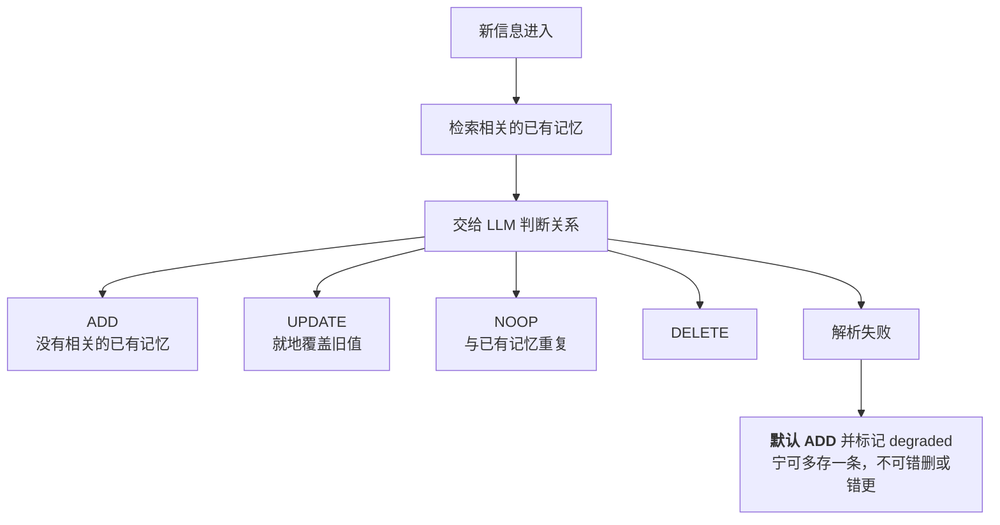

# 第六章 agentic memory 与自组织

> 💡 **一句话**：让记忆自己组织自己，第一次要为写入付真金白银。值不值，看读写比。
>
> ⏱ 约 35 分钟　|　难度 ●●○　|　前置：第 3、5 章　|　💻 `python -m minimem.learn ch06`
>
> **学完你能**
> 1. 实现 extract-update 流水线，并说明每种决策失败时该怎么兜底。
> 2. **算出自组织的打平点**——需要多少次检索才能把写入的钱赚回来。
> 3. 说清楚为什么「抽取错误」比「回答错误」严重得多。
>
> **主线产出**：`minimem/agentic.py` 的 `AgenticMemory`。
>
> **本章实验**：两个，各几秒，全部离线（LLM 用 `ScriptedLLM` 模拟）。

---

## 6.1 五章欠下的债

前五章一路积累了一串「留给 LLM 的活」：

| 欠的债 | 哪一章欠的 |
| :--- | :--- |
| 事实抽取靠正则，抓不到「毛毛」这种没有标志的专名 | 第 4 章 |
| 冲突判定靠「一个属性一个值」，分不清单值多值 | 第 5 章 |
| 什么记忆值得钉住、值得抽取，无从判断 | 第 2、4 章 |

这些都需要**判断力**，而规则给不了判断力。

本章接上 LLM。两条代表性路线：

| 路线 | 核心动作 | 代表工作 |
| :--- | :--- | :--- |
| **自组织** | 写入时生成结构化 note，与旧 note 建链接、并可能触发旧 note 演化 | 📄 A-MEM (arXiv:2502.12110, NeurIPS 2025) |
| **extract-update** | 抽出候选事实，与已有记忆比对，决定 ADD/UPDATE/DELETE/NOOP | 📄 Mem0 (arXiv:2504.19413, ECAI 2025) |

两条解决的是不同问题：前者让记忆之间**长出结构**，后者让记忆**保持一致**。

---

## 6.2 extract-update：写入时先判断一次

```bash
python docs/chapter6/code/01_extract_update.py
```

前五章的写入都是无脑的：给什么存什么。本章让 LLM 先判断新信息和已有记忆是什么关系：

```
  动作        原因                      内容
  ----------------------------------------------------------------------
    ADD     没有相关的已有记忆               我在星辰银行工作，是一名信贷风控工程师
    ADD     新信息                     我住在城西的枫林小区
    ADD     新信息                     我对花生过敏，点餐要特别注意
    NOOP    与已有记忆重复                 对了，我是在星辰银行做风控的
    UPDATE  雇主状态变更                  我下周就要从星辰银行离职了
    UPDATE  住址已搬迁                   上周搬家了，现在住城东的沿江花园
```

**6 条输入，库里只留下 3 条。**



注意最后那条容错分支：**决策失败时默认 ADD**。这是一个刻意选的保守方向——多存一条只是浪费，错删或错更是数据损失。

对比第 4 章：那时这 6 条会原样存下 6 条，检索「我在哪工作」时「星辰银行」和「离职」会一起返回，让模型自己猜。

### 6.2.1 这个「干净」是有代价的

> 🤔 **先猜一猜**
>
> extract-update 把矛盾记忆合并成一条最新的。那么「我三个月前住哪？」这个问题，现在还答得出来吗？
>
> A. 能 —— 记忆更干净了，检索更准
> B. 不能 —— UPDATE 是就地覆盖，旧值没了
>
> <details>
> <summary>想好了再展开</summary>
>
> **B。**
>
> UPDATE 是**就地覆盖**。「枫林小区」那条记忆被「沿江花园」替换了，旧值不再存在。
>
> 而第 5 章的做法（失效而非删除）**是能答的**——它给旧事实盖 `valid_to`，记录留着。
>
> </details>

两种设计解决的是不同的问题：

| | 解决什么 | 代价 |
| :--- | :--- | :--- |
| **extract-update** | 让**当前状态**保持唯一和干净 | 历史丢失 |
| **bi-temporal**（第 5 章） | 让**历史**可查 | 检索时要处理多个版本 |

真实系统往往两个都要：用 extract-update 维护一份「当前视图」，同时用双时间轴保留完整历史。代价是两套机制都要维护。

### 6.2.2 失败时的默认动作

```python
if not isinstance(data, dict) or data.get("action") not in ("ADD", "UPDATE", "NOOP", "DELETE"):
    # 决策失败时**默认 ADD**——宁可多存一条，不可错删或错更。
    return Decision("ADD", None, "决策解析失败，保守处理", new_text, degraded=True)
```

**这个默认值的选择很关键。** 默认 UPDATE 会让一次 JSON 解析失败**覆盖掉一条正确的记忆**；默认 NOOP 会让消息凭空消失。ADD 是唯一「错了也能补救」的选项——多存一条只是浪费空间。

同理，`UPDATE` 说要改但没给出有效编号时，也降级成 ADD。

> ✅ **检查点 6.2**
>
> 为什么 extract-update 决策失败时默认 ADD，而不是 NOOP？
>
> <details>
> <summary>参考答案</summary>
>
> 因为 ADD 是唯一「错了也能补救」的选项。默认 NOOP 会让用户说过的话凭空消失且没有报错；默认 UPDATE 会覆盖掉一条正确的记忆。多存一条只是浪费空间，可以事后清理。
>
> 一般原则：**在写入路径上，失败的默认行为要选那个可逆的。**
>
> </details>

---

## 6.3 动态链接

新 note 写入时，与最相似的几条建立链接：

```python
note.links = [c.id for c in self._nearest(vec, user_id=user_id, k=self.link_top_k)]
# 双向链接：旧 note 也要连回来
for other in note.links:
    if other in self._notes and item.id not in self._notes[other].links:
        self._notes[other].links.append(item.id)
```

**双向是必需的**，否则从旧记忆出发永远找不到新记忆——这是 A-MEM 式「演化」的最小形式。

检索时沿链接扩散一跳：

```python
for linked in self._notes.get(mid, Note("")).links:
    scored[linked] = max(scored[linked], scored[mid] * 0.3)
```

这让「相关但措辞不同」的记忆有机会被带出来。系数 0.3 是经验值，调大会引入噪声。

### 一个真实的权衡

`link_threshold` 最初设的是 0.55，结果**一条链接都建不起来**——自组织悄悄退化成了普通向量库。调到 0.40 后每条记忆平均连 2 条。

- 设太高：没有链接，机制形同虚设
- 设太低：图变成全连接，链接同样没有信息量

这和第 3 章的 `bm25_floor_ratio`、第 4 章的 `ppr_floor_ratio` 是同一类参数：**它们不是调优旋钮，而是决定机制生不生效的开关**，而且都必须按你自己的语料重新标定。

---

## 6.4 账单

```bash
python docs/chapter6/code/02_cost_and_failure.py
```

这是全书第一次成本列不为 0 的章节。

```
  方案                       召回@5    检索 ctx    LLM 调用    写入 token       成本$
  --------------------------------------------------------------------------
  vector（第 3 章）          86.8%        87         0           0   0.00000
  agentic（本章）            88.2%        82        59       11159   0.00167
```

- 召回率略高（88.2% vs 86.8%）
- 检索侧每次省下约 5 token（注入的是 summary 而不是原文）
- 写入侧多花了 **11159 token、59 次 LLM 调用**（30 条 × 2 次：note 生成 + update 决策）

### 6.4.1 打平点

> **打平所需检索次数 = 写入侧额外 token ÷ 每次检索省下的 token**

代入本章的数字：

$$
\frac{11159}{5} \approx 2289
$$

**这批记忆需要被检索 2289 次，自组织才回本。**

这个数字应该让你停下来想一想。30 条记忆被检索两千多次是什么场景？一个高频使用的个人助理可能达到；一个用完即走的客服会话绝对达不到。

> 「判断依据是读写比」这句话本书已经说了五次。这一节给出它的**具体算法**。
> 从现在起，任何一个「让记忆更聪明」的提议，你都可以要求对方先算这个数。

### 6.4.2 召回率的变化要小心解读

召回率从 86.8% 涨到 88.2%——**1.4 个百分点，在 24 道题的基准上就是 0.3 道题**。第 3 章说过：任何一两个百分点的差异都是噪声。

而且这里有两个相反的效应在同时作用：

- summary 去掉了寒暄，**信噪比更高**
- summary 也丢掉了原文细节，**而有些细节正好是答案**

哪个占上风取决于你的语料和问题类型。**所以必须测，不能推。**

---

## 6.5 当 LLM 出错

```
  失败率              加工失败数      召回@5      记忆条数
  --------------------------------------------
  0%                   0     88.2%        30
  20%                  6     88.2%        30
  50%                 15     88.2%        30
```

### 6.5.1 一个意料之外的结果

**加工失败一半，召回率一点没掉。**

这不是实验做错了，而是它说明了一件更重要的事：**在这份语料上，note 加工带来的检索收益微乎其微**。退回原文之后，检索用原文的语义信息和用 summary 差不多。

把它和 6.4.1 节的打平点放在一起看：

- 写入侧多花 11159 token
- 检索侧每次省 5 token
- **加工失败一半，效果不变**

三个数字指向同一个结论：**在这个场景下，note 加工这一步是不划算的**。

这不代表 A-MEM 类方法没价值——它代表**你必须在自己的语料上验证它有没有价值**，而验证方法就是本节这个「故意让它失败」的实验。如果失败率拉到 50% 而指标不动，那这个组件对你的场景就是可以砍掉的。

> 这是第 3 章 `FakeEmbedder` 那个手法的第三次应用：
> **怀疑某个组件有没有用，就把它弄坏，看指标掉不掉。**

### 6.5.2 记忆条数没有减少

这是刻意的设计：**加工失败时退回原文，而不是丢掉这条消息**。

丢消息是记忆系统能犯的最严重的错误之一——用户说过的话凭空消失，而且没有任何报错。

### 6.5.3 但退回原文意味着「悄悄退化」

这条记忆没有 summary、没有标签、没有链接，混在一堆加工好的记忆里，**谁也看不出来**。

所以 `Note.degraded` 这个字段是必须的：

```python
degraded: bool = False
"""加工失败时为 True——此时 summary 就是原文。
**这个字段很重要**：它让「LLM 失败了多少次」变成可观测的，
而不是悄悄地退化。"""
```

**实践建议**：把 degraded 比例接进监控。它突然升高通常意味着 prompt 被改坏了、模型版本变了、或者上游数据格式变了。

### 6.5.4 更危险的一类失败

上面的实验测不出最危险的情况：**抽取错了但格式正确**。

LLM 把「我**不**对花生过敏」总结成「过敏原：花生」，JSON 完全合法，系统欣然接受，然后这条错误事实会被**反复检索、反复使用**。

> **本章最需要记住的一句话：**
>
> **抽取错误会固化进记忆，比一次回答错误严重得多。**
>
> 一次回答错误只影响一次对话；一条错误记忆影响之后的每一次对话，
> 而且它看起来和正确记忆一模一样。

三个可行的防御（都不便宜）：

1. **校验**：抽出的事实要能在原文里找到依据（字符串包含或蕴含判断）
2. **保留原文指针**：第 5 章的 provenance，出问题时能回查
3. **置信度标注**：让 LLM 同时输出置信度，低置信的只存不用

---

## 6.6 关于厂商数字

⚠️ Mem0 与 Zep 在 LoCoMo / LongMemEval 上互报的分数（58.44% / 65.99% / 75.14% / 84% 四个版本）存在严重分歧，且多个仓库报告无法复现。

**第 10 章有完整的拆解**，包括分歧的五个来源和判断任一性能数字的五个问题。本章不重复论述，也**不把任何一方的数字当作结论**。

需要记住的是：本章介绍的机制（note 生成、动态链接、extract-update）是**可以独立评估**的——你可以在自己的数据上测它们各自的收益与成本，而不必依赖任何厂商的对比数字。这正是第 10 章 harness 存在的意义。

---

## 6.7 代价与选型

| 配置 | 每条记忆的 LLM 调用 | 得到什么 | 失去什么 |
| :--- | :--- | :--- | :--- |
| 关掉自组织（第 3 章） | 0 | 便宜、无失败模式 | 记忆杂乱、矛盾并存 |
| 只开 note 生成 | 1 | 去寒暄、有标签、可链接 | 写入贵一倍 |
| note + extract-update | 2 | 当前状态干净唯一 | 写入贵两倍、历史丢失 |
| 再加第 5 章的双时间轴 | 2 + 抽取 | 干净且历史可查 | 两套机制都要维护 |

**决策顺序**：

1. **先算打平点**（6.4.1 节的公式）。算出来是几千次检索的话，先别上。
2. 如果决定上，**先只开 note 生成**。它的收益（去噪、标签）确定性最高，风险最小。
3. extract-update 要配 provenance 一起上——**没有回查能力的自动更新是危险的**。
4. 把 degraded 比例接进监控，从第一天就接。

---

## 6.8 常见误区

**误区一：「自组织让记忆更聪明，所以值得」**

6.4.1 节：本章配置的打平点是 2289 次检索。「值得」是一个可以计算的问题，不是态度问题。

**误区二：「extract-update 让记忆更干净，所以更好」**

6.2.1 节：干净的代价是历史丢失。「我三个月前住哪」变得无解——而第 5 章的做法能答。

**误区三：「LLM 失败了会报错，我能发现」**

6.5.3 节：加工失败退回原文，系统照常工作，只是那条记忆没有 summary、标签和链接。**不加 degraded 标记，这个退化不可观测。**

**误区四：「JSON 解析成功就说明抽对了」**

6.5.4 节：「我不对花生过敏」被总结成「过敏原：花生」，JSON 完全合法。格式正确与内容正确是两回事。

**误区五：「决策失败时该保守地不做任何操作」**

6.2.2 节：NOOP 会让消息凭空消失。写入路径上失败的默认行为要选**可逆**的那个——是 ADD。

---

## 6.9 小结

- 本章接上 LLM，还了前五章欠下的三笔债：抽取召回、冲突判定、重要性判断。
- extract-update 让当前状态干净唯一，代价是**历史丢失**；它和第 5 章的双时间轴解决的是不同问题，真实系统往往两个都要。
- **写入路径上，失败的默认行为要选可逆的那个**——ADD 而不是 UPDATE 或 NOOP。
- `link_threshold` 是决定机制生不生效的开关（0.55 时一条链接都建不起来），不是调优旋钮。这已经是本书第三次遇到这类参数。
- **打平点公式**：写入侧额外 token ÷ 每次检索省下的 token。本章配置算出来是约 2289 次检索。
- 加工失败要退回原文而非丢消息，但必须用 `degraded` 标记让退化**可观测**。
- **抽取错误会固化进记忆，比一次回答错误严重得多**——它影响之后的每一次对话，且看起来和正确记忆一模一样。

---

## 🔧 动手挑战

**🟢 五分钟**

把 `AgenticMemory` 的 `enable_update` 关掉，重跑实验二，看写入成本降多少、记忆条数变多少。

- 起点：`docs/chapter6/code/02_cost_and_failure.py`
- 做对了会看到：LLM 调用减半，但矛盾记忆重新并存（回到第 4 章的状态）

**🟡 半小时到一小时**

实现**抽取校验**：note 的 summary 必须能在原文里找到依据（比如关键词覆盖率 ≥ 50%），否则标记为低置信。然后构造一个「LLM 抽反了」的用例，验证校验能拦住它。

- 起点：`minimem/agentic.py` 的 `make_note`
- 做对了会看到：「我不对花生过敏 → 过敏原：花生」这类反转被标记出来
- 验证：`python -m pytest tests/test_agentic.py -q`

**🔴 半天以上**

把 extract-update 和第 5 章的双时间轴**合起来**：UPDATE 时不覆盖，而是给旧记忆盖 `valid_to`，同时维护一份「当前视图」。验证它既能答「我现在住哪」也能答「我三个月前住哪」。

- 起点：`minimem/agentic.py` 与 `minimem/temporal.py`
- 做对了会看到：两个问题都答对，代价是存储与写入复杂度都上升

---

## 🧠 复习卡片

<details>
<summary>extract-update 和双时间轴分别解决什么问题？</summary>

extract-update 让**当前状态**保持唯一和干净（代价是历史丢失）；双时间轴让**历史**可查（代价是检索时要处理多个版本）。真实系统往往两个都要：用前者维护当前视图，用后者保留完整历史。
</details>

<details>
<summary>extract-update 决策失败时，默认动作该选哪个？为什么？</summary>

**ADD**。因为它是唯一「错了也能补救」的选项——多存一条只是浪费空间。默认 UPDATE 会让一次解析失败覆盖掉正确记忆；默认 NOOP 会让消息凭空消失。一般原则：写入路径上失败的默认行为要选可逆的那个。
</details>

<details>
<summary>怎么算自组织值不值得？</summary>

**打平所需检索次数 = 写入侧额外 token ÷ 每次检索省下的 token。** 本章配置算出来约 2289 次——这批记忆要被检索两千多次才回本。「值得」是可计算的问题，不是态度问题。
</details>

<details>
<summary>为什么「抽取错误」比「回答错误」严重得多？</summary>

一次回答错误只影响一次对话；一条错误记忆影响之后的**每一次**对话，而且它看起来和正确记忆一模一样。最危险的是「抽错了但格式正确」——「我不对花生过敏」被总结成「过敏原：花生」，JSON 完全合法，系统欣然接受。
</details>

<details>
<summary>LLM 加工失败时，为什么要退回原文而不是丢弃？又为什么必须打 degraded 标记？</summary>

丢消息是记忆系统最严重的错误之一——用户说过的话凭空消失且无报错。但退回原文会造成「悄悄退化」：这条记忆没有 summary、标签、链接，混在里面看不出来。`degraded` 字段让「LLM 失败了多少次」变成可观测的量，应该接进监控。
</details>

---

## 🚪 下一章

自组织解决了「记忆怎么变干净」，但没解决一个更基础的问题：**记忆越来越多，而上下文就那么大**。

第 2 章的窗口方案是「丢掉」，第 3 章的检索是「挑几条」。还有第三种做法：**分层**——把记忆放在不同的层里，按热度在层之间搬来搬去。

→ **第 7 章：OS 式分层记忆与调度，以及那个 OS 隐喻到底兑现了多少。**

---

## 参考文献

1. 📄 Xu, W., et al. *A-MEM: Agentic Memory for LLM Agents*. arXiv:2502.12110, NeurIPS 2025. （Zettelkasten 式的 note 生成与动态链接）
2. 📄 Chhikara, P., et al. *Mem0: Building Production-Ready AI Agents with Scalable Long-Term Memory*. arXiv:2504.19413, ECAI 2025. （extract-update 流水线）
3. 📄 Rasmussen, P., et al. *Zep: A Temporal Knowledge Graph Architecture for Agent Memory*. arXiv:2501.13956. （第 5 章的双时间轴，与本章形成对照）

> ⚠️ **关于这两个系统的效果数字**：Mem0 与 Zep 在 LoCoMo/LongMemEval 上互报的分数存在
> 四个互相矛盾的版本，且多个仓库报告无法复现。**本章不引用任何一方的数字作为结论**，
> 完整拆解见第 10 章 10.4 节。
>
> **本章数字的可信度说明**：6.2、6.4、6.5 节的表格来自本章脚本实测，可复现。
> LLM 由 `ScriptedLLM` 模拟——**它模拟的是流程与用量，不是判断力**。
> 换成真实模型后，决策质量与失败模式都会变，但**成本结构（每条 1~2 次调用）不变**。
