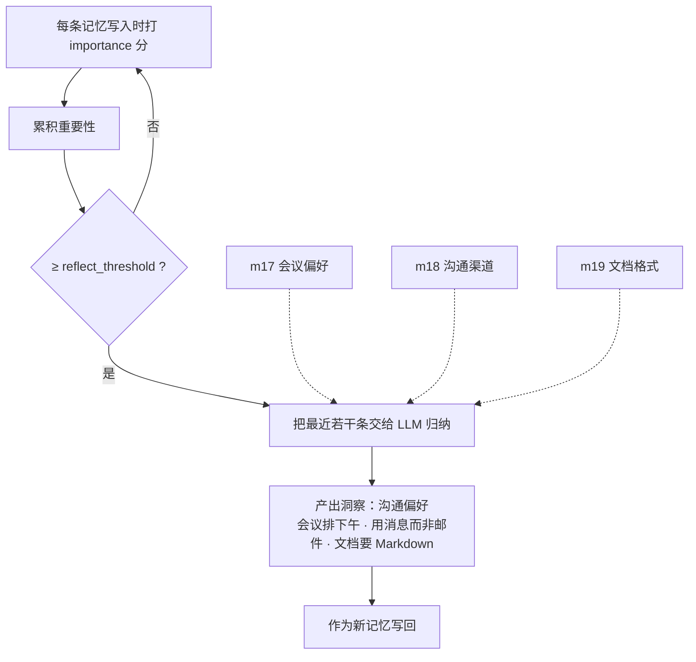
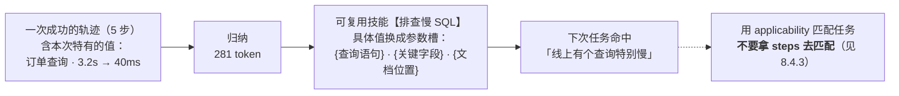

# 第八章 经验与技能记忆

> 💡 **一句话**：前七章记的是「发生了什么」，这一章记的是「该怎么做」。
>
> ⏱ 约 35 分钟　|　难度 ●●○　|　前置：第 1、3 章　|　💻 `python -m minimem.learn ch08`
>
> **学完你能**
> 1. 说清楚 recency / relevance / importance 三项打分各自解决什么，以及**为什么照搬会亏**。
> 2. 判断反思（reflection）值不值得开，以及它的触发条件为什么全是启发式的。
> 3. 实现一个能被复用的技能库，并指出它最容易犯的三个设计错误。
>
> **主线产出**：`minimem/skill.py` 的 `SkillMemory`。
>
> **本章实验**：两个，各几秒，全部离线（LLM 用 `ScriptedLLM` 模拟）。

---

## 8.1 一类不同的记忆

前七章的记忆都是**关于世界的事实**：他叫小明、他对花生过敏、他换了工作。

本章处理另一类：**关于怎么做事的经验**。

```
事实型：  「订单查询接口很慢。」
经验型：  「查询慢先看执行计划，再查 join 条件是否漏字段。」
```

用第 1 章的话说，前者是陈述性的（declarative），后者是程序性的（procedural）。

> **本书的用词纪律在这里要再强调一次**：我们不说「实现了程序记忆」，
> 而说「存了带触发条件和步骤的可复用流程」。
> 前者听起来实现了一个认知类别，后者才是你要维护的那张表。

三个机制，对应三篇有代表性的工作：

| 机制 | 来源 | 一句话 |
| :--- | :--- | :--- |
| **importance 打分** | 📄 Generative Agents (UIST 2023) | 让重要的记忆更容易被想起来 |
| **reflection** | 📄 Generative Agents / Reflexion | 从多条记忆归纳出更高层的洞察 |
| **技能库** | 📄 Voyager / AWM | 把成功的轨迹变成可复用的流程 |

---

## 8.2 importance：第三项打分

### 8.2.1 它是什么

第 1 章的 `BufferMemory` 用两项打分：

$$
\text{score} = (1-w)\cdot\text{relevance} + w\cdot\text{recency}
$$

Generative Agents 用三项，多的那一项是 **importance**——写入时给每条记忆打 1~10 分：

```
     9  我对花生过敏，点餐要特别注意。
     2  今天天气不错，中午在楼下吃的面。
     6  开会尽量安排在下午，我上午效率低。
     2  帮同事看了一段 SQL，有个 join 写错了。
```

本书提供两个实现：规则版（正则匹配几类模式，零成本）和 LLM 版（每条一次调用）。

> 规则版存在有两个理由：一是让本章离线可跑；二是给 LLM 打分提供一个**对照基线**——
> 如果 LLM 打分不比这个简单规则强，那它就不值那笔钱。
> 这是第 3 章 `FakeEmbedder` 那个手法的又一次应用。

### 8.2.2 加上它，检索变好了吗

> 🤔 **先猜一猜**
>
> 在 MiniBench 上加入 importance 这一项，分能力表会怎么变？
>
> A. 全面提升
> B. 大部分提升，但有几类明显变差
> C. 基本没变化
>
> <details>
> <summary>想好了再展开</summary>
>
> **B。而且变差的那几类很有规律。**
>
> </details>

```bash
python docs/chapter8/code/01_importance.py
```

```
    配置                       总召回    直接检索  同义改写  专有名词    多跳    时序  知识更新    归纳    拒答
    ------------------------------------------------------------------------------------
    两项打分（第 1 章）          54.9%     50%     40%    100%    25%    50%     58%     0%   100%
    三项打分（+importance）      65.3%    100%     60%    100%     0%    50%     33%    25%   100%
```

总召回涨了十个百分点。但看分能力：

- **明显变好**：直接检索（50%→100%）、同义改写（40%→60%）、归纳（0%→25%）
- **明显变差**：多跳（25%→**0%**）、知识更新（58%→33%）

原因不难理解。多跳题的第二跳记忆往往是「XR-2049 上线后复核量下降四成」这种**重要性不高但正好是答案**的内容。importance 把「过敏」「离职」这类高分记忆顶上去，恰好把它们挤了下来。

> **结论不是「importance 没用」，而是：打分函数要按任务选，不能因为论文用了就照抄。**
>
> Generative Agents 的三项打分是为「模拟有连续生活的 agent」设计的——那个场景要的是「像人一样想起重要的事」，不是「答对多跳问答」。照搬到问答系统里，你可能买到一个负收益。

### 8.2.3 代价

规则版：0 次调用，0 token。

LLM 版：**每条记忆一次调用**。30 条记忆约 4600 token（含反思那一次）。折算到每万条记忆约 150 万 token。

判断依据仍然是**读写比**——这是本书第四次说这句话：

- 写一次读一百次 → 打分成本被摊薄，划算
- 写一次读一次 → 纯亏，不如直接用 relevance 排序

还有一个容易忽略的点：**importance 是写入时打的，之后不会变**。一条当时看着不重要的记忆，可能三个月后变得关键（「上次那个 join 写错的问题」——出问题时才知道它重要）。重新打分意味着重新花钱，而多数系统从不重打。

> ✅ **检查点 8.2**
>
> 为什么加入 importance 之后，多跳类的召回率反而掉到 0？
>
> <details>
> <summary>参考答案</summary>
>
> 多跳题需要召回「第二跳」的中间记忆，而这类记忆通常**重要性不高**（「XR-2049 上线后复核量下降四成」既不是身份也不是禁忌）。importance 把高分记忆顶上前列，恰好挤掉了它们。
>
> 这说明打分函数是有**任务偏好**的：为「模拟生活」设计的打分，用在问答上会伤害多跳能力。
>
> </details>

---

## 8.3 反思

### 8.3.1 机制

累积重要性越过阈值时，把最近若干条记忆交给 LLM，让它归纳出更高层的洞察，作为新记忆写回。

```bash
python docs/chapter8/code/02_reflection_and_skills.py
```

```
    写入 30 条记忆后：{'记忆总数': 30, '累积重要性': 270, '反思次数': 0}
    累积重要性已达阈值？True

    反思产出 1 条洞察：
      · 沟通偏好：会议排下午、用消息而非邮件、文档要 Markdown
```



这条洞察的价值在于：它**不在任何单条记忆里**。原始记忆是三条散落在不同时间的偏好（m17、m18、m19），反思把它们综合成了一条可直接使用的结论。

📄 Generative Agents 论文报告：去掉 reflection 后，agent 在 48 模拟小时内退化为重复的、无上下文的响应。
📄 Reflexion 报告在 HumanEval 上 pass@1 从 0.80 提升到 0.91（把失败的教训写进记忆再重试）。

### 8.3.2 触发条件全是启发式的

```python
def maybe_reflect(self, *, user_id, force=False):
    if not force and not self.should_reflect(user_id=user_id):
        return []
```

而 `should_reflect` 就是「累积重要性 ≥ 阈值」。

> **所有已发表系统的 reflection 触发条件都是启发式的**：定时、计数、或阈值。
> **没有哪个系统真的实现了「自发反思」。**

这和第 1 章批评「巩固并不自动」是同一个问题，只是换了个位置出现：

| 第 1 章说的 | 本章的对应 |
| :--- | :--- |
| 「情景记忆→语义记忆的巩固很少是自动的」 | 反思由计数器触发，不是 agent「觉得该反思了」 |
| 「多数系统需要显式 prompt 或启发式触发」 | `reflect_threshold` 就是那个启发式 |

调 `reflect_threshold` 等于调「多久花一次这个钱」。

### 8.3.3 成本结构

```
    这一轮的账：31 次 LLM 调用，4641 token。
    其中绝大部分是 importance 打分（每条记忆一次），反思本身只有 1 次。
```

但要注意两者的**单次成本差别很大**：

| 操作 | 频率 | 单次 token |
| :--- | :--- | :--- |
| importance 打分 | 每条记忆一次 | 一两百 |
| **反思** | 每 N 条一次 | **几千**（要把最近十几条全塞进 prompt） |
| 技能归纳 | 每次轨迹一次 | 几百到几千 |

**反思是重操作。** 频率低但单价高，这类成本在按次计费时最容易被低估——你看到「只调用了 1 次」就放心了，而那 1 次可能比前面 30 次加起来还贵。

### 8.3.4 反思会产生的新问题

**复述型洞察。** 真实模型经常把几条记忆复述一遍就当成洞察输出。这类内容会污染记忆库：占地方、被检索、还显得像新知识。

**自激振荡。** 反思产物本身也是记忆，如果它也累加重要性，就会触发下一次反思，无限循环。代码里显式排除了这种情况：

```python
if item.kind not in ("reflection", "skill"):
    self._accumulated[user_id] += item.metadata["importance"]
```

**错误固化。** 这是第 6 章讨论过的：反思一旦归纳错，错误结论会作为「高层洞察」被反复检索，比一次回答错误严重得多。

---

## 8.4 技能库

### 8.4.1 存代码还是存流程

两条路线：

| | Voyager | AWM（Agent Workflow Memory） |
| :--- | :--- | :--- |
| 存什么 | **可执行代码** | 带 trigger 与参数槽的结构化流程 |
| 需要 | 沙箱执行环境 | 无 |
| 验证 | 跑一遍就知道对不对 | 需要人或 LLM 判断 |
| 适用 | 有明确执行环境（游戏、代码） | 通用任务 |

📄 Voyager 报告：去掉技能库后，tech-tree 里程碑的达成速度损失约 15.3×。

> ⚠️ 这是 Minecraft 特定环境下的结果。那个环境有两个特殊性：动作空间明确、成功可自动验证。
> **不能外推成「技能库普遍带来 15 倍提升」。**

本书走 AWM 路线——更通用，也不需要执行环境。

### 8.4.2 实测

```
    第一次遇到这类问题，走了 5 步：
      1. 同事说订单查询接口很慢
      2. 拉了那条 SQL，看执行计划
      3. 发现 join 条件漏了一个字段，走了全表扫描
      4. 补上索引后从 3.2s 降到 40ms
      5. 把结论写进了团队文档

    归纳出的可复用流程（花了 281 token）：
      【排查慢 SQL】适用于：同事反馈某个查询很慢，需要定位原因
        1. 拿到 {查询语句} 与执行环境
        2. 看执行计划，确认是否走了索引
        3. 检查 join 条件是否写错或缺失
        4. 对 {关键字段} 补索引后复测
        5. 把结论同步到 {文档位置}

    ── 第二次遇到类似问题 ──
    任务：「线上有个查询特别慢，帮我看看什么原因」
    命中技能：排查慢 SQL（成功率 0%，用过 0 次）
```



注意归纳做了两件事：**去掉了本次特有的值**（3.2s、40ms、订单查询），**把它们换成了参数槽**。

### 8.4.3 三个最容易犯的设计错误

**错误一：拿 steps 去匹配任务。**

```python
def find_skill(self, task, *, user_id):
    """匹配的是 trigger 而不是 steps。"""
```

用户描述的是**问题**（「查询特别慢」），而 trigger 描述的正是「什么问题适用」。steps 描述的是解法——拿解法去匹配问题，方向反了。这是 AWM 的关键设计。

**错误二：把「没用过」当成「一定成功」。**

```python
@property
def success_rate(self) -> float:
    """没用过时返回 0.0——**不是 1.0**。"""
    return self.successes / self.uses if self.uses else 0.0
```

如果新技能默认满分，那么一个刚归纳出来、从未验证过的流程会被优先推荐，而经过多次检验的老技能反而排在后面。

**错误三：只记成功的。**

Reflexion 的核心恰恰是把**失败**的教训写进记忆、下次避开。只记成功的技能库，会一直重复同一个错误——因为「上次这么干失败了」这条信息从来没被存下来。

---

## 8.5 关于本章数字的免责说明

本章的 LLM 是 `ScriptedLLM` **模拟的**。它按预设返回格式正确的洞察和流程，不会归纳错、不会漏、不会返回非法 JSON。

换成真实模型后，**下面这些会变**：

- **反思质量**。模拟器输出的洞察是手写的；真实模型可能综合得更好，也可能只是复述——后者很常见。
- **技能归纳的泛化程度**。哪些值该抽成参数、哪些该保留，需要判断力。
- **失败率**。真实调用会超时、返回非法 JSON、拒答。这些失败的代价见第 6 章。

**不变的是成本结构**：importance 每条一次、反思每轮一次且很贵、技能归纳每次一次。这部分结论可以直接带走。

---

## 8.6 代价与选型

| 机制 | 触发频率 | 单次成本 | 什么时候开 |
| :--- | :--- | :--- | :--- |
| importance（规则） | 每条 | 0 | 总是可以开 |
| importance（LLM） | 每条 | 一两百 token | 读写比高，且**任务不是多跳型** |
| reflection | 每 N 条 | 几千 token | 需要「跨记忆的结论」时 |
| 技能归纳 | 每次成功轨迹 | 几百到几千 | 任务有重复模式 |

**决策顺序**：

1. **先上规则版 importance**，它免费，而且能告诉你 importance 这一项对你的任务是正收益还是负收益。
2. 如果是负收益（像 MiniBench 的多跳），**别上 LLM 版**——你会花钱买负收益。
3. 反思只在「需要跨记忆结论」时开。如果你的场景只问单条事实，反思产出的东西没人用。
4. 技能库只在任务有重复模式时值得。一次性任务归纳出来的流程永远不会被复用。

---

## 8.7 常见误区

**误区一：「加上 importance 检索一定更好」**

8.2.2 节的实测：多跳从 25% 掉到 0%，知识更新从 58% 掉到 33%。打分函数有任务偏好。

**误区二：「agent 会自己决定什么时候反思」**

8.3.2 节：所有已发表系统都是定时/计数/阈值触发。这和第 1 章批评的「巩固并不自动」是同一件事。

**误区三：「反思调用次数少，所以便宜」**

8.3.3 节：反思频率低但**单价高**（要把十几条记忆全塞进 prompt）。按次数看会严重低估。

**误区四：「技能库照着论文的 15 倍提升来估算收益」**

8.4.1 节：那是 Minecraft 环境的结果，该环境动作空间明确、成功可自动验证。不能外推。

**误区五：「新归纳的技能应该优先推荐」**

8.4.3 节：没验证过的技能成功率应记为 0，不是 1。否则未经检验的流程会压过久经考验的。

---

## 8.8 小结

- 经验型记忆和事实型记忆的差别，在于它回答「怎么做」而非「是什么」。本书用「带触发条件和步骤的可复用流程」描述它，而不是「程序记忆」这个类别名。
- **importance 打分有任务偏好**：它提升直接检索与归纳，但**伤害多跳**（实测掉到 0）。照搬论文的打分函数可能买到负收益。
- 反思能产出「不在任何单条记忆里」的洞察，但它的触发条件**全是启发式的**——这是第 1 章「巩固并不自动」的同一个问题换了位置。
- 反思是**低频高价**操作，按调用次数估算成本会严重低估。
- 技能库的三个常见设计错误：拿 steps 匹配任务、把没用过当成一定成功、只记成功不记失败。
- 本章的 LLM 是模拟的，**反思质量与归纳泛化度换真模型会变，但成本结构不变**。

---

## 🔧 动手挑战

**🟢 五分钟**

把 `SkillMemory` 的 `weights` 从 `(0.2, 0.5, 0.3)` 改成 Generative Agents 的等权 `(1/3, 1/3, 1/3)`，重跑实验一，看分能力表怎么变。

- 起点：`docs/chapter8/code/01_importance.py` 里构造 `SkillMemory` 的地方
- 做对了会看到：recency 权重变大后，「时序」类可能变好而「同义改写」变差——**权重就是任务偏好**

**🟡 半小时到一小时**

实现**动态 importance**：一条记忆每被成功召回一次，重要性 +0.5（上限 10）。这样「当时不重要但后来常被用到」的记忆能自己浮上来。用实验一验证它对多跳的伤害是否减轻。

- 起点：`minimem/skill.py` 的 `_search`，在返回结果时回写
- 做对了会看到：多次检索后，多跳类的召回率回升
- 验证：`python -m pytest tests/test_skill.py -q`

**🔴 半天以上**

实现**失败技能库**：记录失败的轨迹与失败原因，检索时把「上次这么做失败了」一并注入上下文。设计一个实验证明它确实减少了重复犯错——注意这需要你先构造一个「会重复犯错」的场景。

- 做对了会看到：同一类任务的第二次尝试避开了第一次的坑

---

## 🧠 复习卡片

<details>
<summary>为什么加入 importance 打分后，多跳类召回率反而下降？</summary>

多跳题需要召回「第二跳」的中间记忆，而这类记忆通常重要性不高（「XR-2049 上线后复核量下降四成」既不是身份也不是禁忌）。importance 把高分记忆顶到前列，恰好挤掉了它们。说明打分函数有任务偏好，不能照搬。
</details>

<details>
<summary>「自发反思」存在吗？</summary>

不存在。所有已发表系统的 reflection 触发条件都是启发式的——定时、计数、或阈值。这和第 1 章批评「情景记忆到语义记忆的巩固并不自动」是同一个问题换了个位置出现。
</details>

<details>
<summary>为什么说「反思调用次数少所以便宜」是错的？</summary>

反思是**低频高价**操作：它要把最近十几条记忆全塞进 prompt，单次几千 token；而 importance 打分单次只有一两百。按调用次数估算成本会严重低估——1 次反思可能比 30 次打分加起来还贵。
</details>

<details>
<summary>技能库检索该匹配 trigger 还是 steps？为什么？</summary>

匹配 **trigger**。用户描述的是「问题」，trigger 描述的正是「什么问题适用」；steps 描述的是解法。拿解法去匹配问题，方向反了——这是技能库最常见的设计错误。
</details>

<details>
<summary>没用过的技能，成功率该记 0 还是 1？</summary>

**0**。记 1 的话，刚归纳出来、从未验证过的流程会被优先推荐，而久经考验的老技能反而排后面。另外还要记失败——只记成功的技能库会一直重复同一个错误。
</details>

---

## 🚪 下一章

到这里，全书的记忆都存在**上下文里**——不管是原文、向量、图、事实还是技能，最终都要拼进 prompt 才起作用。

还有第三种可能：把记忆直接写进**模型权重**。

→ **第 9 章：参数化记忆，以及它为什么还不能作为主路线。**

---

## 参考文献

1. 📄 Park, J. S., O'Brien, J. C., Cai, C. J., Morris, M. R., Liang, P., Bernstein, M. S. *Generative Agents: Interactive Simulacra of Human Behavior*. UIST 2023, DOI: 10.1145/3586183.3606763. （三项打分与 reflection 的出处）
2. 📄 Shinn, N., et al. *Reflexion: Language Agents with Verbal Reinforcement Learning*. NeurIPS 2023. （把失败教训写进记忆）
3. 📄 Wang, G., et al. *Voyager: An Open-Ended Embodied Agent with Large Language Models*. 2023. （技能库存可执行代码）
4. 📄 Wang, Z., et al. *Agent Workflow Memory*. 2024. （带 trigger 与参数槽的 workflow，本章走的路线）
5. ExpeL、Synapse、ReasoningBank —— 同一族的其他做法，机制差异见附录 B。

> **本章数字的可信度说明**：8.2、8.3、8.4 节的表格与输出来自本章脚本实测，可复现。
> 引用的 Generative Agents（48 小时退化）、Reflexion（0.80→0.91）、Voyager（15.3×）
> 均为 📄 论文原文自报，且都在各自特定的实验环境下取得——
> ⚠️ 尤其 Voyager 的 15.3× 是 Minecraft 环境的结果，**不可外推**。
